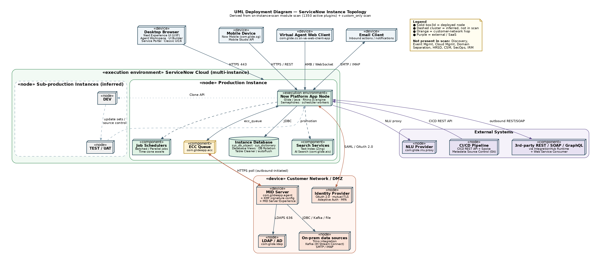
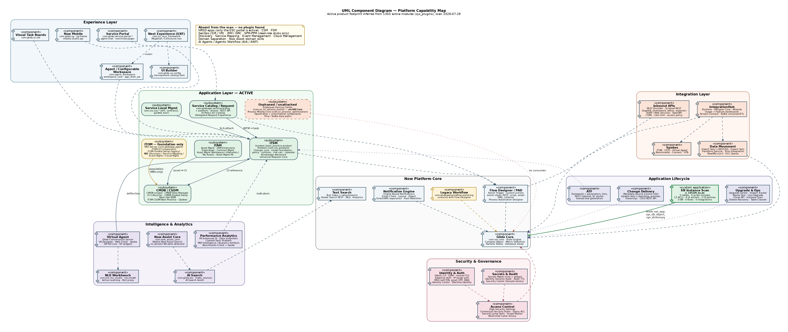
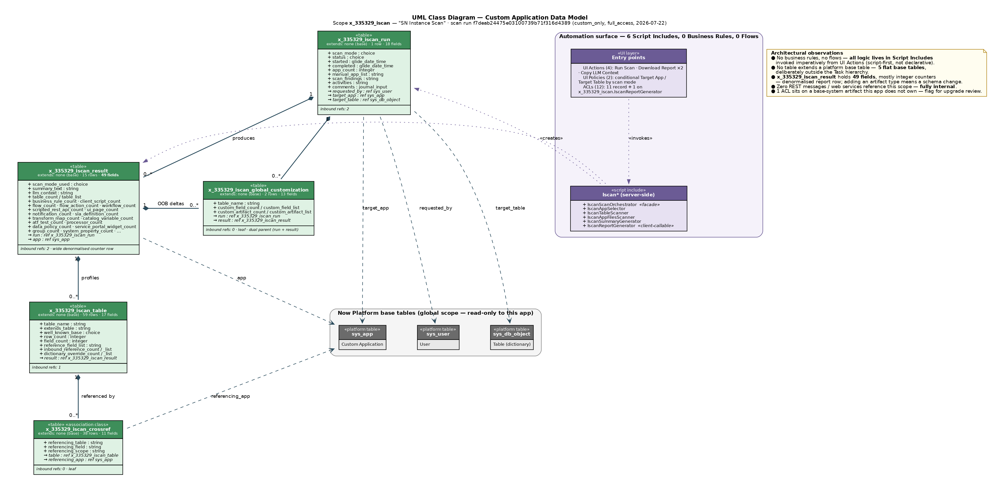

**ServiceNow**

**Instance Architecture Assessment**

Derived from sn-instance-scan run reports

Version 1.0 — Draft

29 July 2026

| **Evidence** | **Detail** |
| --- | --- |
| Scan run 1 | f7deab24475e03100739b71f316d4389 — mode custom_only, full_access, completed 2026-07-22 09:14:35 |
| Scan run 2 | f4be3f3247d6cb100739b71f316d43b8 — mode modules, completed 2026-07-29 10:09:56 |
| Scope in scan 1 | x_335329_iscan — "SN Instance Scan" (1 application) |
| Modules in scan 2 | 1350 installed, 1350 active, 0 status mismatch |
| Method baseline | 202210_Assessment Navigator v0.1 (structure only; no data reused) |

# **Contents**

# **1. Executive summary**

This document reconstructs the architecture of the assessed ServiceNow instance from two sn-instance-scan run reports. It describes the deployment topology, the active platform capability footprint, and the design of the one custom application captured in the scan. Three UML views are supplied in Annex A.

## **1.1 What the instance is**

The instance is a single-domain, ITSM-centric Now Platform deployment with 1350 active modules and no activation drift (0 status mismatches). Its application footprint is narrow: ITSM, Service Catalog / Request, Service Level Management, IT Asset Management and CMDB are fully activated; Customer Service Management, Field Service Management, Security Operations, Integrated Risk Management and SPM/PPM are absent. HR Service Delivery is absent except for one orphan — the Employee Service Center portal is active with no HR Core behind it.

The platform layer, by contrast, is broad and modern: the full Next Experience / UI Builder / Agent Workspace stack, IntegrationHub with Kafka and Trino connectivity, GraphQL, Now Assist Core, AI Search, and the complete Virtual Agent and NLU Workbench stack are all active. The instance therefore carries a large amount of capability that the application layer is not yet consuming.

## **1.2 Headline findings**

| **#** | **Finding** | **Severity** | **Area** |
| --- | --- | --- | --- |
| 1 | ITOM is present as foundation only — MID Server and ITOM UI components are active, but Discovery, Service Mapping, Event Management and Cloud Management are not installed. No automated CMDB population source is evidenced by the scan. | High | CMDB / ITOM |
| 2 | The custom application x_335329_iscan places an ACL on a base-system artifact it does not own. This is an upgrade-collision surface flagged by the scan itself. | High | Custom app / upgrade |
| 3 | All custom-app logic lives in Script Includes invoked from UI Actions — zero business rules, zero flows. Nothing enforces integrity for records created via list edit, Import Set or REST. | High | Custom app design |
| 4 | Legacy Workflow (com.glideapp.workflow.authoring) is active alongside Flow Designer and Process Automation Designer — two automation stacks to maintain and upgrade-test. | Medium | Automation |
| 5 | Deprecated and orphaned modules remain active: ITSM Workspace, ITSM Workspace Landing Pages, CMDB Agent Workspace, OAuth 2.0 legacy — plus Employee Service Center (com.sn_hr_service_portal) with no HR Core behind it. | Medium | Technical debt |
| 6 | Now Assist Core, AI Search and the full Virtual Agent stack are active, but no domain Now Assist skills and no AI Agent / Agentic Workflow modules were found — paid-for foundation is under-exploited. | Medium | AI / value |
| 7 | x_335329_iscan_result carries 49 fields, mostly per-artifact-type integer counters. Every new artifact type requires a schema change rather than a data row. | Medium | Data model |
| 8 | Scan run 2 scanned 0 applications. There is no instance-wide custom-application inventory — only one scope has been profiled. | Medium | Assessment coverage |
| 9 | The custom app duplicates part of what the OOB Instance Scan, Upgrade Center and Upgrade Impact Tracker (all active) already provide. | Low | Duplication |

# **2. Scope, method and confidence**

## **2.1 What the evidence is**

Two sn-instance-scan run reports were analysed. They are metadata scans of the instance, not runtime or infrastructure telemetry.

| **Run** | **What it covers** |
| --- | --- |
| f7deab24… (custom_only, full_access) | One application scope, x_335329_iscan. Because the scanning user had full_access, the data-model section is complete: table list, field lists, row counts, dictionary overrides, and the outbound/inbound reference graph. |
| f4be3f32… (modules) | sys_plugins inventory only — 1350 modules with plugin ID, active state in sys_plugins, confirmed active state, and mismatch flag. Apps scanned: 0, so it contains no application or table data. |

## **2.2 What the scans cannot tell us**

- Physical topology. Instance count, datacentre pair, node count, HA/DR configuration and database sizing are not in scope of either scan. The deployment view in Annex A is a logical reconstruction.

- Release / patch level. No version field is present. The strongest signal is the module Security Center Xanadu Family (com.glide.security_center_x_family), which implies Xanadu or later. Treat as inferred.

- Licensing and subscription consumption. No user counts, role counts or subscription data were captured.

- Whether a module that is active is actually used. Activation is not adoption — the modules scan proves installation, not usage.

- Process configuration. Category trees, assignment rules, SLA definitions, catalog structure and portal inventory are not in the module scan.

- Custom applications other than x_335329_iscan. Only one scope was profiled.

## **2.3 Confidence statement**

**High confidence: **the module inventory, the activation state of every listed plugin, and the entire data model, automation surface and reference graph of x_335329_iscan. These are read directly from the reports.

**Medium confidence: **the capability map in Annex A, Figure 2. Product footprint is inferred from anchor plugins; a suite can be partially licensed or activated without every anchor being present.

**Inferred, flagged in the diagram: **the sub-production instances, the promotion path and the external endpoints behind the MID Server. Metadata Source Control, Update Sets, Clone API and the CICD REST API are all active, which makes a multi-instance pipeline near-certain, but the scan does not name the instances.

# **3. Platform baseline**

## **3.1 Module inventory**

1350 modules are installed and 1350 are active, with zero mismatches between sys_plugins state and confirmed state. A clean activation state is a good sign: it means no half-activated plugins that typically surface as broken UI actions or missing tables after an upgrade.

## **3.2 Active application footprint**

| **Suite** | **State** | **Evidence (anchor modules)** |
| --- | --- | --- |
| ITSM | Active | com.snc.problem · com.snc.change_management (+ change_model.foundation, policy, collision, bestpractice.change_risk, change_request_calendar, sn_chg_rest) · com.snc.best_practice.incident.london · com.snc.knowledge_advanced · com.snc.universal_request_core · com.snc.itsm.roles · com.snc.itsm.spoke |
| Service Catalog / Request | Active | com.glideapp.servicecatalog (+ .platform, .wizard, .rest.api, .workspace, .macroponent) · com.glide.ui_policy_catalog · delegated_request_experience |
| SLM | Active | com.snc.sla.atf · com.snc.sla.contract2 · com.snc.sla.guided_tour |
| ITAM | Active | com.snc.asset_management · com.snc.sam · com.snc.fixed_asset · com.snc.contract_management · com.sn_itam_workspace · com.sn_itam_recomm · com.snc.asset_myassets · com.snc.ast_mgmt_pa |
| CMDB / CSDM | Active | com.snc.cmdb.scoped · com.snc.cmdb.ci_lifecycle_manager (CMDB Data Manager) · com.snc.cmdb.guided_setup · com.snc.ng_bsm · com.snc.best_practice.itsm_csdm.quebec |
| ITOM | Foundation only | com.glideapp.agent (MID Server) + kmf_config + agent.experience · com.snc.itom.ui · com.snc.guided_setup_metadata.itom. No Discovery, Service Mapping, Event Management or Cloud Management application module found. Note: com.devsnc_sn_service_mapping is a Next Experience UI component that ships with the framework — it is not the Service Mapping application. |
| HRSD | Orphaned | Employee Service Center (com.sn_hr_service_portal) is ACTIVE, but HR Core (com.sn_hr_core) and every other HRSD module are absent. A portal with no application behind it — either a decommissioned HRSD attempt or an accidental activation. Confirm and deactivate. |
| CSM / FSM | Absent | No anchor modules. Only one stray CSM workspace UI component (com.snc.uib.special_handling_notes) is present, which ships with the workspace framework. |
| Process Optimization | Active | com.sn_process_optimization (Process Mining Core) — process-mining capability is installed and not referenced anywhere else in the footprint. |
| Telephony / omnichannel | Active | com.sn_openframe_integration (OpenFrame), com.sn_components_omnichannel_interaction, com.glide.cs.collab, com.glide.service-portal.agent-chat — a CTI/contact surface exists without CSM behind it. |
| SecOps / IRM-GRC | Absent | No Security Incident Response, Vulnerability Response, Policy & Compliance or Risk module found. |
| SPM / PPM | Absent | Only read-only role stubs (com.snc.pmo_read_roles, com.snc.tm2_read_roles). The applications themselves are not installed. |

## **3.3 Governance posture**

- **No domain separation. **No domain-support module is present, so the instance is single-domain. Fine for an internal IT shop; a blocker if the instance ever has to serve multiple legal entities with data isolation.

- **Delegated Development is on **(com.glide.delegated_development, com.sn_dd_user_admin), which implies non-admin developers work in named scopes.

- **High Security Settings is active **(com.glide.high_security), together with Contextual Security Rules, Query ACL support and Scoped Application Restricted Caller Access — a defensible baseline.

# **4. Deployment architecture**

See Annex A, Figure 1.

## **4.1 Access channels**

Four client channels are evidenced. Desktop browser access runs on the Next Experience UI framework (com.sn_nxui_framework) with Magellan and Concourse navigation, Agent / Configurable Workspace, UI Builder and Service Portal all active in parallel — meaning three generations of UI are live simultaneously. Now Mobile (com.glide.sg with theming, applet launcher and Studio API) is active. The Virtual Agent Web Client is deployed as a standalone app. Inbound and outbound email is fully configured, including reply parsing, bounce management, SMTP exponential backoff, and automatic user creation from inbound mail.

## **4.2 Instance tier**

The production instance runs the standard Glide application node against the instance database. Notable database-layer modules are Database Rotation (with default tables), Database Views, Remote Tables and the Table Cleaner upgrade plugin — the presence of rotation and Table Cleaner suggests a deliberate data-retention strategy on high-volume tables. Search runs on both the classic Text Index (Zing) and AI Search. Job execution uses batched and parallel schedulers with time-zone-aware scheduling.

## **4.3 Customer network hop**

The MID Server is the only inbound-safe path from the ServiceNow cloud to the customer network. It polls the ECC Queue outbound over HTTPS, so no inbound firewall rule is required. MID Server Key Management Framework signature configuration is active, which means MID Server payloads are signed. LDAP support and the Trino integration are both present, and IntegrationHub Stream Connect with a Kafka consumer and Kafka ETL consumer is active — so at least one streaming data path exists.

**Note: **with no Discovery module, the MID Server is being used for integration and LDAP traffic, not for CI discovery. That is a legitimate pattern, but it means CMDB population is either manual or driven by inbound integrations, neither of which the scan can confirm.

## **4.4 Identity and authentication**

The authentication surface is broad: OAuth 2.0, LDAP, certificate-based (mutual TLS) authentication, IP-range based authentication, Adaptive Authentication, an External Authentication Framework, and three multi-factor factor types (soft PIN, email OTP, knowledge-based). Identity Center, Machine Identity Management and Machine Identity Access Control are also active, which points at service-account and non-human-identity governance being in scope.

## **4.5 Sub-production and promotion**

Metadata Source Control (Git), Update Sets with batching, preview and hierarchy support, the Clone API, Live Upgrade, Upgrade Center, Upgrade Impact Tracker and the Upgrade Blame Tool are all active, alongside the CICD REST API and CICD Spoke. This is a mature change-delivery toolchain. The scan does not name the sub-production instances, so Figure 1 shows them as an inferred dashed cluster.

# **5. Capability architecture**

See Annex A, Figure 2.

## **5.1 Where the value sits**

The application layer is coherent: ITSM sits at the centre, Service Catalog feeds it, SLM attaches to it, ITAM and CMDB provide the asset and configuration spine, and CSDM guidance is present via the Quebec best-practice content pack. This is a classic IT-operations instance.

## **5.2 Where the gap sits**

ITOM is the structural weak point. The CMDB modules are all installed — including CMDB Data Manager, which manages CI lifecycle and de-duplication — but there is no discovery or service-mapping engine to feed them. A CMDB with governance tooling and no automated ingestion tends to degrade into a manually maintained inventory. Next-Gen BSM is active, which suggests service maps were at least intended.

## **5.3 Two automation stacks**

Flow Designer is fully deployed: Action Trigger, system-level actions, and action steps for REST, script, email, email header, email attachments, SMS and collectors, plus Process Automation Designer core runtime. Legacy Workflow authoring is also active. Both are supported, but running both means two upgrade-test surfaces, two skill sets and ambiguity about where new automation should go. Establishing a written rule — new automation in Flow Designer, legacy workflows migrated on touch — is the standard remediation.

## **5.4 The AI layer**

Now Assist Core, AI Search (with index sources and AI Search Assist), the complete Virtual Agent stack (Conversation Server, Designer, Web Client, Spoke, platform topics, topic blocks, Service Management VA Core, Service Portal widgets) and NLU Workbench with Active Learning are all active. What is not present is any domain Now Assist skill module and any AI Agent or Agentic Workflow module. The conversational and search foundation is in place; the generative and agentic layer on top of it is not.

## **5.5 Capability installed with nothing attached to it**

Four capabilities are active but have no application in the footprint that would consume them. Each is either a decommissioned initiative, an accidental activation, or an untapped opportunity — the scan cannot distinguish between the three, so each needs a direct answer from the client.

- **Employee Service Center (com.sn_hr_service_portal) **— an HRSD portal with no HR Core, HR Case Management or any other HRSD module installed. Highest priority of the four: an active portal with no application behind it is an unmonitored entry point.

- **Process Mining Core (com.sn_process_optimization) **— process-optimisation capability with no evidence of a consuming process.

- **OpenFrame + omnichannel interaction components **(com.sn_openframe_integration, com.sn_components_omnichannel_interaction, com.glide.cs.collab) — a CTI / contact-centre surface without CSM. It may be serving the Service Desk against Incident, which would be a reasonable pattern worth documenting.

- **Trino and Kafka data paths **(com.snc.integration.trino, com.glide.hub.kafka_consumer, com.glide.hub.etl_consumer.kafka) — an analytics or data-lake integration with no visible application-layer owner.

# **6. Custom application architecture — x_335329_iscan**

See Annex A, Figure 3.

## **6.1 Purpose**

"SN Instance Scan" is a self-assessment tool. It walks the instance metadata, records what each application owns, detects customisations made to base-system tables, builds a cross-reference graph between scoped tables, and emits both a human-readable report and a block of LLM context. The two PDFs analysed in this document are its own output.

## **6.2 Data model**

Five custom tables, none of which extends a platform base table. All five are flat base tables sitting deliberately outside the Task hierarchy — correct for a reporting application, since none of these records is work assigned to a person.

| **Table** | **Rows** | **Fields** | **Role and outbound references** |
| --- | --- | --- | --- |
| x_335329_iscan_run | 1 | 18 | Scan execution header. → requested_by (sys_user), target_app (sys_app), target_table (sys_db_object) |
| x_335329_iscan_result | 15 | 49 | Per-application result row. → run, app (sys_app). 49 fields, dominated by per-artifact-type counters. |
| x_335329_iscan_table | 59 | 17 | Per-table profile: row count, field count, dictionary overrides, reference lists. → result |
| x_335329_iscan_crossref | 38 | 11 | Association class: which table is referenced by which field of which table, in which scope. → table, referencing_app (sys_app) |
| x_335329_iscan_global_customization | 2 | 13 | Customisations made to base-system tables. → run and result (dual parent) |

The graph is a clean two-level hierarchy — run → result → table → crossref — with global_customization hanging off both run and result. The dual parentage on global_customization is the only redundancy: result already points at run, so run is derivable. Harmless at this scale, but it is a second place for referential drift.

## **6.3 Automation surface**

Zero business rules. Zero flows. Zero client scripts. All logic lives in six server-side Script Includes with a clear separation of concerns:

IscanScanOrchestrator   — entry facade, drives the run

IscanAppSelector        — resolves which apps to scan for a given mode

IscanTableScanner       — profiles tables, fields, references

IscanAppFilesScanner    — inventories application artifacts

IscanSummaryGenerator   — builds summary_text and llm_context

IscanReportGenerator    — builds the exportable report (client-callable; has its own ACL)

Those Script Includes are invoked imperatively from four UI Actions (Run Scan, Download Report ×2, Copy LLM Context). Two UI Policies conditionally show Target App / Target Table depending on the scan mode. Twelve ACLs protect the five tables plus the report generator.

**Architectural consequence: **this is a script-first, not a declarative, application. It reads cleanly and is easy to unit-test, but because no business rule guards the tables, any record created through list edit, Import Set, Table API or a Fix Script bypasses every invariant the Script Includes enforce. If those tables are ever written to by anything other than the orchestrator, the model has no defence.

## **6.4 Integration points**

None. The scan states explicitly that no REST message or web service references this scope. The application is fully internal to the instance — which also means the two PDF reports are exported manually rather than pushed to a downstream system.

## **6.5 The flagged customisation**

The scan flags one base-system table this application does not own but has added an artifact to: an ACL on x_335329_iscan.IscanReportGenerator. Custom ACLs on artifacts outside the owning scope are exactly the class of change that vendor updates silently conflict with. Document it in the upgrade runbook and re-verify it after every family upgrade.

# **7. Integration architecture**

The integration layer is materially more capable than the application layer needs, which is worth noting for cost and for future roadmap.

| **Channel** | **Evidence** |
| --- | --- |
| IntegrationHub | Runtime, Designer Core, Wizards, usage and feature dashboards, Stream Connect common core and schema, Kafka consumer, Kafka ETL consumer, One API FlowDesigner/IH execution environment |
| Spokes | ITSM Spoke, CICD Spoke, Virtual Agent Spoke, Benchmarks Spoke, Connect Spoke, Visual Task Board Spoke |
| Inbound APIs | REST API Provider, Scripted REST APIs (+ internal, error types, code signing), GraphQL (framework, schema editor, explorer, contextual-search and knowledge schemas), SOAP / System Web Services, OpenAPI, CORS support, rate limiting, REST and SOAP access policies |
| Outbound | Web Service Consumer (+ code signing), IntegrationHub action step REST, Outbound Tracking |
| Data movement | Import Sets (+ REST/IH support, web-service import set tables), Export Sets, Transformation Service, Trino Integration, NowMQ v1 and v2, ECC Queue |
| Email | Email Service, Accounts, Client (+ template, layout, digest), inbound reply parser, address filters, ordered processing, bounce management, automatic user creation, unsubscribe, retention |

Two things stand out. First, GraphQL is fully deployed including the explorer and schema editor — unusual, and a sign that at least one modern consumer exists. Second, Trino plus Kafka indicates an analytics or data-lake integration path that is not visible anywhere in the application layer.

# **8. Security and access architecture**

- **Access control: **High Security Settings, Contextual Security Rules, Security Jump Start (ACL Rules), Query ACL support for store applications, Scope Master, Scoped Application Restricted Caller Access, Application Design Restrictions, Processor Access Policy.

- **Identity: **OAuth 2.0 (and the deprecated legacy plugin, still active), LDAP, mutual-TLS certificate auth, IP-range auth, Adaptive Authentication, external auth framework and API, three MFA factor types, Identity Core / Center / Security, Federated ID Generation, Machine Identity Management and Access Control.

- **Secrets and audit: **Secrets Management (core and global), System Properties Update API (vault security center), Identity Security Audit, Audit TTL, Security Center (Xanadu family).

- **API hardening: **REST API Access Policy, SOAP API Access Policy, REST rate limiting, CORS support, API Key and HMAC authentication, REST API auth scope, provider and consumer code signing.

This is a well-covered security surface. The one concrete item to close is the OAuth 2.0 legacy plugin (com.snc.platform.security.oauth.legacy), whose own description says not to activate it — it is active alongside the current OAuth 2.0 plugin.

# **9. Application lifecycle and upgrade readiness**

The toolchain is strong. Automated Test Framework is deployed with parameters, lists, REST inbound, Service Catalog Service Portal support and hosted one-click test generation. Metadata Source Control provides Git integration. Update Sets support batching, preview and hierarchy. Upgrade Center, Upgrade Impact Tracker, Upgrade Blame Tool, Upgrade to Customized, Skipped Records Rule Engine and Live Upgrade are all active, as is the Clone API and Delete Recovery with partial undelete.

Two caveats. First, tooling being installed is not the same as tooling being used — the scan cannot show ATF test counts or clone cadence, and this is exactly the gap the base Assessment Navigator methodology calls out. Second, the custom application reports zero ATF tests of its own, so there is no regression net around it.

**Also worth noting: **the platform Instance Scan plugin (com.glide.instance_scan) is active. Together with Upgrade Center and Upgrade Impact Tracker it already covers part of what the custom x_335329_iscan application does. Before extending the custom app, confirm what it adds beyond the OOB tooling — the answer is probably the cross-scope reference graph and the LLM context export, which the OOB tools do not produce.

# **10. Recommendations**

| **#** | **Recommendation** | **Why** | **Priority** |
| --- | --- | --- | --- |
| 1 | Decide the CMDB population strategy. Either license and deploy Discovery / Service Mapping, or formally document the integration-based population path and put CMDB Health reporting behind it. | CMDB governance tooling is installed with no evidenced ingestion engine. | High — architecture |
| 2 | Document the ACL on x_335329_iscan.IscanReportGenerator in the upgrade runbook and add a post-upgrade verification step. | Scan-flagged base-system customisation; silent vendor conflict risk. | High — upgrade |
| 3 | Add server-side guards to the custom app: at minimum a before-insert/update business rule on x_335329_iscan_run and _result, or ACLs that block direct write outside the orchestrator. | All invariants currently live in Script Includes that list edit, Import Set and Table API bypass. | High — custom app |
| 4 | Write and enforce an automation-stack rule: new automation in Flow Designer, legacy workflows migrated when touched. Inventory what still runs on legacy Workflow. | Two live automation stacks double upgrade-test cost. | Medium |
| 5 | Deactivate the deprecated and orphaned modules — ITSM Workspace, ITSM Workspace Landing Pages, CMDB Agent Workspace, OAuth 2.0 legacy, Employee Service Center — after confirming nothing references them. | Deprecated code paths are upgrade liabilities and audit findings; an orphan portal is an unmonitored entry point. | Medium |
| 6 | Normalise x_335329_iscan_result: replace the ~40 per-artifact-type counter fields with a child table keyed by artifact type. | Today every new artifact type is a schema change and an update set; as a child table it is a data row. | Medium — custom app |
| 7 | Build a Now Assist / AI value case. The foundation (Now Assist Core, AI Search, Virtual Agent, NLU) is active and unexploited; the natural first step is VA deflection plus AI Search on Knowledge Advanced. | Capability is already paid for and activated. | Medium — value |
| 8 | Create ATF regression tests for the custom app, starting with the Run Scan UI Action path. | ATF is deployed instance-wide; the custom app has no coverage. | Medium |
| 9 | Re-run sn-instance-scan in custom_only mode with full_access across every scope, not just x_335329_iscan. | Run 2 scanned 0 applications; there is no instance-wide custom inventory. | Medium — assessment |
| 10 | Confirm the release and patch level, clone cadence and sub-production topology directly — none of it is in the scan data. | Closes the largest evidence gap in this assessment. | Low — but do it first |

# **11. Open questions**

The following cannot be answered from the scan data and should be confirmed with the client before this document is treated as final:

- Exact release and patch level; last clone date and clone cadence.

- Instance topology: how many sub-production instances, and their promotion order.

- Subscription position: licensed vs. active users, and which suites are actually paid for.

- How the CMDB is populated today, and by what.

- Whether Virtual Agent is live to end users, and with which topics.

- Whether the Trino and Kafka paths are in production use, and by which consumer.

- How many custom scopes exist beyond x_335329_iscan, and their size.

- ATF test coverage and whether it is run pre-upgrade.

# **Annex A — Architecture views (UML)**

Three UML views. Figure 1 is a deployment diagram; Figure 2 a component diagram; Figure 3 a class diagram. Full-resolution PNG and SVG versions are supplied alongside this document.

*Figure 1 — UML deployment diagram: instance topology. Dashed clusters are inferred, not present in the scan data.*

*Figure 2 — UML component diagram: platform capability map, derived from 1350 active modules.*

*Figure 3 — UML class diagram: data model and automation surface of x_335329_iscan.*

# **Annex B — Reusable prompt**

Paste the following into a new conversation and attach the sn-instance-scan PDFs. It is written to reproduce this deliverable against any instance.

*The same text is supplied as a standalone file, reusable_prompt.md.*

# Reusable prompt — ServiceNow instance architecture from sn-instance-scan reports

Attach the sn-instance-scan PDF(s) and paste everything below the line.

---

Act as a ServiceNow Certified Technical Architect. Attached are one or more

`sn-instance-scan` run reports for a client instance. Reconstruct and document that

instance's architecture, then produce a client-ready assessment.

## 1. Extract before you interpret

Parse every attached PDF programmatically (pdfplumber or equivalent) — do not skim.

Extract, per report:

- Run header: scan mode, status, started/completed, requested_by, apps scanned.

- Scan findings log verbatim.

- For `custom_only` / `full_access` runs, per application:

scope name, vendor, artifact inventory with counts AND the named artifacts

(script includes, business rules, flows, ACLs, UI actions, UI policies, client

scripts, scheduled jobs, scripted REST, notifications, SLA definitions, catalog

items, ATF tests, fix scripts, processors, portals/widgets, import sets);

the full data model (each table: extends, well-known base, row count, field list

with types, dictionary overrides, inbound reference count); the outbound

reference graph; base-system tables the app customises but does not own; the

cross-reference table.

- For `modules` runs: the complete `sys_plugins` table — plugin display name, plugin

ID, active in sys_plugins, confirmed active, status mismatch. Report the row count

you parsed and reconcile it against the count in the findings log; state the delta

if any (table rows split across page breaks get dropped).

Persist the parsed data (e.g. JSON) before analysing it.

## 2. Derive the capability footprint from anchor plugins

Do NOT keyword-count. For each suite, decide Active / Foundation-only / Absent by

checking named anchor plugins, and cite the anchors you found:

| Suite | Anchor examples |

|---|---|

| ITSM | `com.snc.problem`, `com.snc.change_management`, `com.snc.best_practice.incident.*`, `com.snc.knowledge_advanced` |

| Request | `com.glideapp.servicecatalog(.platform/.wizard/.rest.api)` |

| SLM | `com.snc.sla.*` |

| ITAM | `com.snc.asset_management`, `com.snc.sam`, `com.snc.fixed_asset`, `com.snc.contract_management` |

| CMDB/CSDM | `com.snc.cmdb.*`, `com.snc.cmdb.ci_lifecycle_manager`, `com.snc.ng_bsm`, `com.snc.best_practice.itsm_csdm.*` |

| ITOM | `com.glideapp.agent` (MID), `com.snc.discovery`, `com.snc.service_mapping`, `com.glideapp.itom.*`, event mgmt, cloud mgmt |

| HRSD / CSM / FSM | `com.sn_hr_core`, `com.sn_customerservice`, `com.snc.work_management` |

| SecOps / IRM | `com.snc.security_incident`, `com.snc.vul`, `com.sn_grc*` |

| SPM/PPM | `com.snc.project*`, `com.snc.demand*`, `com.snc.sdlc*` (read-role stubs alone ≠ installed) |

| AI | `com.now_assist_core`, `com.glide.ais`, `com.glide.cs*` (Virtual Agent), `com.snc.nlu_studio`, plus any Now Assist skill / AI Agent / Agentic Workflow modules |

| Integration | `com.glide.hub.*` (IntegrationHub), spokes, `com.glide.graphql*`, `com.glide.rest*`, `com.glideapp.ecc` |

| Security | `com.glide.high_security`, `com.glide.acl.service`, `com.snc.platform.security.oauth`, MFA/adaptive auth, `com.glide.sm.*` |

| ALM | `com.glide.automated_testing_framework`, `com.glide.source_control`, `com.glide.system_update_set*`, `com.glide.continuousdelivery`, `com.glide.upgrade_center` |

Explicitly list the suites that are **absent** — absence is a finding.

Also flag: domain separation present/absent; deprecated modules still active;

release-indicating plugins (e.g. `*_x_family` → Xanadu family) and mark the release

as **inferred**.

## 3. Produce three UML views

Render with Graphviz (`dot`) to both PNG at ≥150 dpi and SVG. Keep aspect ratio

under about 2.3:1 so the images stay readable on a landscape page. Use invisible

weighted edges to force vertical layering if a diagram spreads too wide, and do NOT

use `splines=ortho` (it silently drops edge labels).

1. **Deployment diagram** — client tier (browser / mobile / VA web client / email),

ServiceNow cloud (prod app node, database, search, schedulers, ECC queue),

sub-production instances, customer network / DMZ (MID Server, LDAP, IdP, on-prem

sources), external systems (3rd-party APIs, CI/CD, NLU provider). Use UML

stereotypes («device», «node», «execution environment», «component»). Draw the

MID Server link as outbound-initiated ECC polling. **Mark everything inferred with

a dashed border and say so in the legend.**

2. **Component diagram** — capability map in layers: Experience, Application,

Intelligence & Analytics, Platform Core, Integration, Security & Governance,

Application Lifecycle. Put each custom scope in as a «custom application»

component. Include a note box listing what is absent.

3. **Class diagram** — for each custom scope: every table as a UML class with real

field names and types, stereotypes, row/field counts, aggregation (filled diamond)

for parent-child, dashed dependencies to platform tables (`sys_app`, `sys_user`,

`sys_db_object`, `task`, `cmdb_ci`), multiplicities, and a separate compartment

for the automation surface (script includes, business rules, flows, UI actions,

ACLs). Add a note box with architectural observations.

## 4. Write the assessment (.docx, English)

Structure — cover page, TOC, then:

1. Executive summary — what the instance is, plus a severity-ranked findings table.

2. Scope, method and confidence — what the scans cover, what they cannot tell you

(topology, release, licensing, adoption, process config, other scopes), and an

explicit High / Medium / Inferred confidence statement.

3. Platform baseline — module inventory, activation drift, suite footprint table

with anchor-plugin evidence, governance posture.

4. Deployment architecture — access channels, instance tier, MID Server hop,

identity, sub-production and promotion.

5. Capability architecture — where value sits, where the gaps are, automation-stack

split, the AI layer.

6. Custom application architecture — one subsection per scope: purpose, data model

table, automation surface, integration points, flagged base-system customisations.

7. Integration architecture.

8. Security and access architecture.

9. Application lifecycle and upgrade readiness.

10. Recommendations — numbered table with recommendation, why, priority.

11. Open questions — everything the scan cannot answer.

- Annex A: the three UML figures on **landscape** pages, with captions.

- Annex B: this prompt.

## 5. Rules

- **Never invent.** Every claim traces to a scan value or a named plugin. If it does

not, label it `⚠️ Inferred` and say what would confirm it.

- If the data model section says it was unavailable (mode was not `full_access`),

treat the data model as **UNKNOWN** — do not conclude the app has no tables.

- Activation ≠ adoption. Say so wherever it matters.

- Use correct platform terminology and inline code formatting for table names, field

names, plugin IDs, scopes and API classes.

- Call out release-dependent behaviour and state the release you are assuming.

- Verify at the end: re-read the extracted data and check every number in the

document against it. Report any figure you could not confirm.

Deliver: the `.docx`, the three PNG + SVG diagrams, and the Graphviz `.dot` sources.
