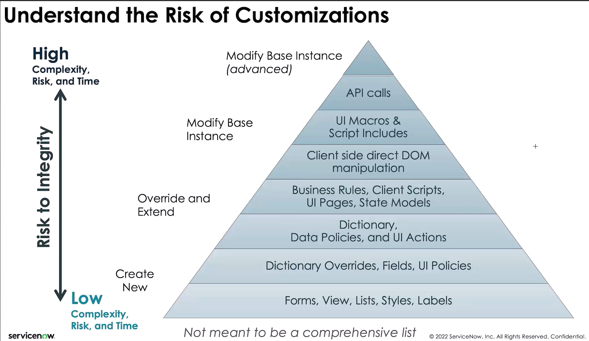

---
aliases:
  - "Applications"
area: "Vault Root"
source: notion-export
tags:
  - applications
  - update-sets
  - anonymize-data
  - update-set-mover
---

# Applications

[Anonymize data](Applications/Anonymize%20data%201d5c42ce9a5680878592e8666c64969d.md)

[Update Set Mover](Applications/Update%20Set%20Mover%201d8c42ce9a568021abeffdd059487678.md)

[Update sets - Full Applications](Applications/Update%20sets%20-%20Full%20Applications%201d8c42ce9a568030a8bbca9f6a85e74b.md)

## Related
- [[Ideas]]

- [[Anonymize data]]
- [[Update Set Mover]]
- [[Update sets - Full Applications]]
- [[ServiceNow]]