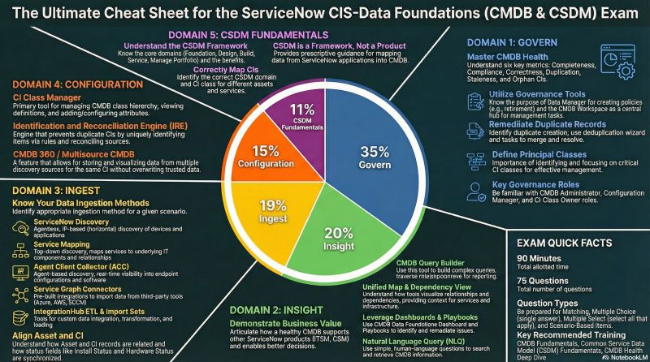

---
aliases:
  - "Certified Implementation Specialist in Data Founda – Tips"
area: "CIS"
source: notion-export
tags:
  - cis-certification
  - cmdb
  - csdm
  - data-foundations
  - exam-prep
---

# Tips

Questions were practical usually formed like "What would administrator do if…" and then simple question from some topic.

Remember the **tab names** and its context in the cmdb workspace, many questions asked underneath which tab certain report or information is.

Learn the CSDM. There were too many questions asking on the elements of each domain. Example "Technical service offering belongs underneath which CSDM domain?" and so on. CSDM 4 knowledge is sufficient because there were the new labels in brackets.

Learn the basic property names mentioned in course like:

glide.identification_engine.multisource_cmdb_ci_enabled and what they do.

There was a new type of questions - matching question almost similar to those which were in the course knowledge checks.

Learn how the cmdb works from user perspective, there were question like "where do cmdb users work on the de-duplication tasks."

---

Basic knowledge of CMDB/CSDM with little critical thinking should be enough to pass the test. As a tip go through all knowledge checks from the course, it will definitively help you.

A lot of questions on the CSDM model, relations between the components, which domain they belong in and also which domains the different personas belong in(for example Product Owner etc)

Also many questions like "How would a CMDB admin import data with IRE", "A CMDB admin found duplicate, should the admin delete, merge or keep it as it is etc"

Many questions where you will drag and drop statements where they belong. As mentioned in this thread, the knowledge checks and basic understanding of of CMDB and CSDM will suffice

---

The questions were quite specific. There were questions like "in which workspace can I find this" etc. It's worth remembering the ingestion methods and their definitions, e.g. ACC, Discovery, SGC. 

The whole CSDM graphic is also worth remembering, including all the agents that take part in the implementation. I got one question like "what does this playbook say about this issue", but it was easy to figure out. I got a few questions on how to activate CMDB 360 and dynamic reconcilliation rules. Definitelly, do all the labs and quizes. It's guaranteed you'll get something like this at the exam.

---

𝗘𝘅𝗮𝗺 𝗙𝗼𝗿𝗺𝗮𝘁

- 90 minutes, 75 questions
- Question types: matching, multiple choice, multiple select, scenario-based
- Prerequisite: CSA certification + ~2 years CMDB experience recommended

⸻

𝗧𝗵𝗲 𝟱 𝗗𝗼𝗺𝗮𝗶𝗻𝘀 (𝗮𝗻𝗱 𝗪𝗵𝗮𝘁 𝘁𝗼 𝗦𝘁𝘂𝗱𝘆)

𝗖𝗼𝗻𝗳𝗶𝗴𝘂𝗿𝗮𝘁𝗶𝗼𝗻 (𝟭𝟱%) — CI Class Manager, IRE setup, CMDB 360 / multisource configuration

𝗜𝗻𝗴𝗲𝘀𝘁 (𝟭𝟵%) — Discovery phases (Scan → Classification → Identification → Exploration), Service Mapping, ACC, Service Graph Connectors, Import Sets + transform scripts for IRE

𝗚𝗼𝘃𝗲𝗿𝗻 (𝟯𝟱%) — The biggest section. CMDB Health Dashboard, Data Manager policies, Duplicate CI Remediator, the 3Cs (Completeness, Correctness, Compliance), CI lifecycle management

𝗜𝗻𝘀𝗶𝗴𝗵𝘁 (𝟮𝟬%) — Query Builder, Unified Map, dependency views, articulating business value of CMDB data

𝗖𝗦𝗗𝗠 𝗙𝘂𝗻𝗱𝗮𝗺𝗲𝗻𝘁𝗮𝗹𝘀 (𝟭𝟭%) — Mapping CIs to correct domains, staged adoption (Foundation → Crawl → Walk → Run → Fly), business benefits

⸻

𝗞𝗲𝘆 𝗖𝗼𝗻𝗰𝗲𝗽𝘁𝘀 𝘁𝗼 𝗠𝗮𝘀𝘁𝗲𝗿

- IRE prevents duplicates — Discovery and Service Graph Connectors use it by default. Import Sets do NOT.
- Discoverable vs. Non-Discoverable data — Discovery finds hardware/software/IPs. You must manually add Assigned to, Support group, Change Group.
- MID Server — the bridge between your instance and internal network
- Principal Classes — focus governance on your most critical CI types first

---

𝗪𝗲𝗲𝗸 𝟭: 𝗙𝗼𝘂𝗻𝗱𝗮𝘁𝗶𝗼𝗻𝘀, 𝗜𝗥𝗘 & 𝗜𝗻𝗴𝗲𝘀𝘁 (𝗗𝗼𝗺𝗮𝗶𝗻𝘀 𝟭, 𝟮 & 𝟱)

Cover CSDM Domains, CI Class Hierarchy, Identification Rules, Independent vs. Dependent CIs, Reconciliation Rules, Datasource Precedence, Discovery phases, and Suggested Relationships.

Activities: Flashcards for "Application Service" vs. "Business Application". Set Data Source Precedence rules in your PDI. Complete the CMDB Micro-Certification Simulator.

⸻

𝗪𝗲𝗲𝗸 𝟮: 𝗚𝗼𝘃𝗲𝗿𝗻𝗮𝗻𝗰𝗲 & 𝗟𝗶𝗳𝗲𝗰𝘆𝗰𝗹𝗲 (𝗗𝗼𝗺𝗮𝗶𝗻 𝟯 — 𝟯𝟱% 𝗼𝗳 𝗘𝘅𝗮𝗺)

This is the most critical week. Cover Completeness, Correctness, Compliance metrics, CMDB Health Dashboard, Duplicate CI Remediator, Life Cycle Stage/Status, Principal Classes, and Data Manager Policies.

Activities: Calculate health scores manually. Use the Remediation Rule form in your PDI. Complete the CMDB Health Micro-Certification Simulator.

⸻

𝗪𝗲𝗲𝗸 𝟯: 𝗜𝗻𝘀𝗶𝗴𝗵𝘁, 𝗩𝗶𝘀𝘂𝗮𝗹𝗶𝘇𝗮𝘁𝗶𝗼𝗻 & 𝗘𝘅𝗮𝗺 𝗣𝗿𝗲𝗽 (𝗗𝗼𝗺𝗮𝗶𝗻 𝟰)

Cover Unified Map vs. Dependency View, CMDB Query Builder, NLQ keywords, and CMDB 360 capabilities.

Activities: Build complex queries in your PDI. Review weak areas. Take the official Blueprint Sample Questions like the real exam (no notes). Final flashcard blitz.

⸻

𝗞𝗲𝘆 𝗧𝗶𝗽𝘀

→ Weekends are for simulators and hands-on labs

→ Sundays are for review and self-testing

→ IRE logic and Health metrics trip up the most people — I'd spend 40% of your time here

---

5 CMDB critical concepts

⸻

𝟭. 𝗜𝗻𝗴𝗲𝘀𝘁𝗶𝗼𝗻 𝗶𝘀 𝗮𝗻 𝗲𝗰𝗼𝘀𝘆𝘀𝘁𝗲𝗺, 𝗻𝗼𝘁 𝗮 𝘀𝗶𝗻𝗴𝗹𝗲 𝘁𝗼𝗼𝗹

I thought "Discovery" was the only answer. For CIS-DF, you need to understand the full spectrum: Horizontal Discovery finds infrastructure, Service Mapping provides business context, ACC gives you real-time visibility and software metrics that agentless scans just can't catch, and Service Graph Connectors ensure data consistency across third-party tools like Azure and AWS.

𝟮. 𝗜𝗺𝗽𝗼𝗿𝘁 𝗦𝗲𝘁𝘀 𝗱𝗼𝗻'𝘁 𝘂𝘀𝗲 𝗜𝗥𝗘 𝗯𝘆 𝗱𝗲𝗳𝗮𝘂𝗹𝘁

We've all used Import Sets and Transform Maps. But this "oldest method" does not use the Identification and Reconciliation Engine by default. This is how you end up with duplicates. You need a transform map script to force data through IRE.

𝟯. 𝗡𝗼𝗻-𝗱𝗶𝘀𝗰𝗼𝘃𝗲𝗿𝗮𝗯𝗹𝗲 𝗱𝗮𝘁𝗮 𝗶𝘀 𝘁𝗵𝗲 𝗳𝗼𝗿𝗴𝗼𝘁𝘁𝗲𝗻 𝘀𝘁𝗲𝗽

Automated tools can't tell you who to call when a server dies. ServiceNow explicitly recommends a "crucial next step" that many teams forget: supplementing discovered data with non-discoverable attributes like "Owned by," "Support group," and "Location". Without these, your incident and change processes will never truly be streamlined

𝟰. 𝗠𝗼𝗿𝗲 𝗱𝗮𝘁𝗮 ≠ 𝗯𝗲𝘁𝘁𝗲𝗿 𝗱𝗮𝘁𝗮

It’s tempting to scan everything, but scanning an entire IP network is a recipe for "data overload". I learned that "good governance" means being prescriptive with Discovery Ranges and utilizing the Discovery Configuration Console to focus strictly on Principal Classes—the specific devices your organization actually intends to manage.

𝟱. 𝗗𝗮𝘁𝗮 𝗙𝗼𝘂𝗻𝗱𝗮𝘁𝗶𝗼𝗻 𝗣𝗹𝗮𝘆𝗯𝗼𝗼𝗸𝘀 𝗵𝗮𝘃𝗲 𝗮 𝘀𝗽𝗲𝗰𝗶𝗳𝗶𝗰 𝗼𝗿𝗱𝗲𝗿

ServiceNow has a four-step sequence:

1. Summary of indicator (What are we measuring?)

2. Overview of problem (What is wrong?)

3. Importance of addressing issue (Why does the business care?)

4. Fix or Improve (The actual remediation)

## Related
- [[CIS]]
- [[How to access a Technical Challenge]]
- [[Architectural Principles]]

- [[Certified Implementation Specialist in Data Founda]]
- [[Study material]]
- [[Comparing various things]]
- [[Exam questions]]
- [[CMDB]]