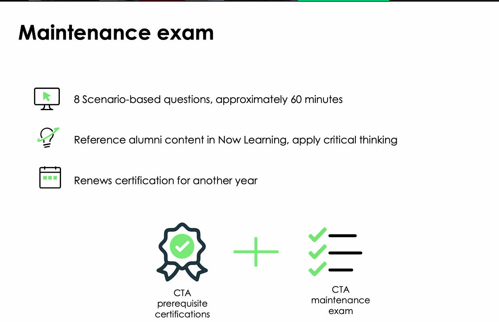

---
aliases:
  - "CTA"
tags:
  - cta-program
  - exam-prep
  - case-study
  - sovereign-bank
  - architecture-principles
  - governance
---

# CTA

[Class Schedule](CTA/Class%20Schedule%20190c42ce9a56807ab5c1d0f2ee605241.md)

[Topics for Pre-study](CTA/Topics%20for%20Pre-study%2017dc42ce9a5680f4a986caaa58b70050.md)

[Examples from gpt](CTA/Examples%20from%20gpt%20180c42ce9a568019b859c3c600e80907.md)

[CTA Exam Scope](CTA/CTA%20Exam%20Scope%20184c42ce9a56809f99facb5177a278cf.md)

[Case study](CTA/Case%20study%20192c42ce9a5680ad8261f08b48a05c87.md)

[00. Ready to launch](CTA/00%20Ready%20to%20launch%20190c42ce9a56801baae7f15b78c91f0d.md)

[01. Week 1](CTA/01%20Week%201%20193c42ce9a5680558654c283768347db.md)

[02. Week 2](CTA/02%20Week%202%2019dc42ce9a56802fb0ccd771d032cb90.md)

[03. Week 3](CTA/03%20Week%203%201a9c42ce9a56801a91b4e58ceb86ab37.md)

[04. Week 4](CTA/04%20Week%204%201abc42ce9a5680a28557e5696357f5d4.md)

[05. Week 5](CTA/05%20Week%205%201b1c42ce9a56801d9032cd96ec9ec204.md)

[06. Week 6](CTA/06%20Week%206%201b7c42ce9a568030a517d160ef88d0c5.md)

[07. Week 7](CTA/07%20Week%207%201c1c42ce9a5680c3be2bfaf5b18ba7b9.md)

[08. Week 8](CTA/08%20Week%208%201c7c42ce9a5680939e23dcb378a5fe37.md)

[09. Week 9](CTA/09%20Week%209%201cec42ce9a5680ec9324e4d06ab93470.md)

[10. Week 10](CTA/10%20Week%2010%201dcc42ce9a568028a810ca639e51e212.md)

[11. Week 11](CTA/11%20Week%2011%201e1c42ce9a568011a9c3e250f5bee7f5.md)

[12. Capstone Assessment](CTA/12%20Capstone%20Assessment%201e1c42ce9a5680ab8a83f3afd5a83884.md)

## Related

- [[Class Schedule]]
- [[Topics for Pre-study]]
- [[CTA Exam Scope]]
- [[00 Ready to launch]]
- [[01 Week 1]]
- [[12 Capstone Assessment]]