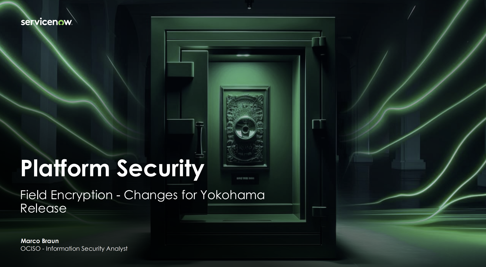
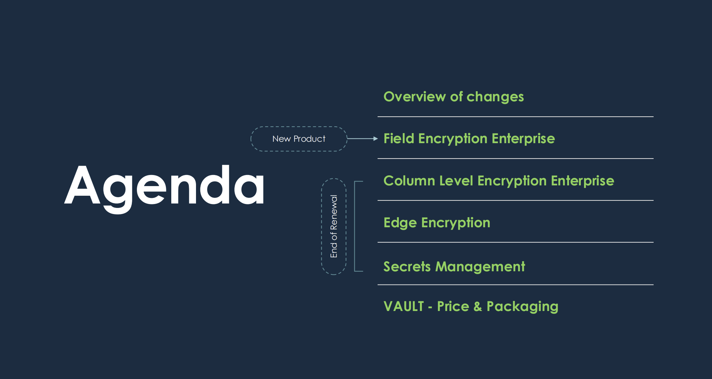
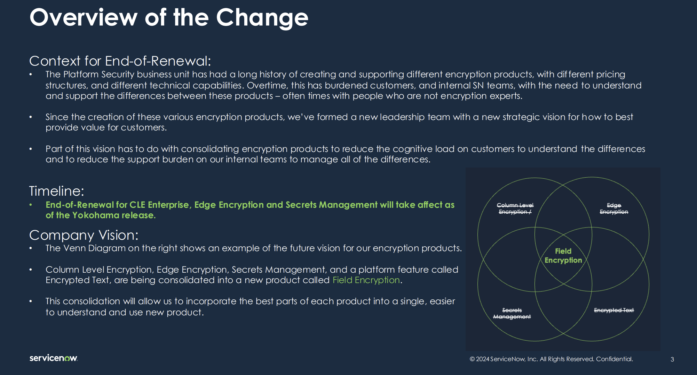
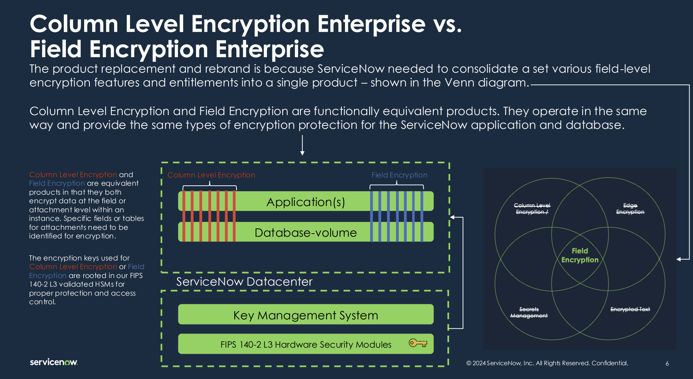
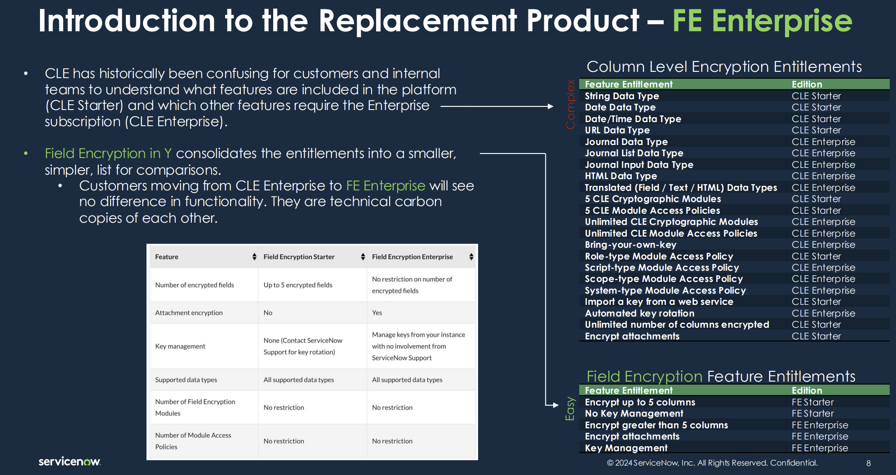
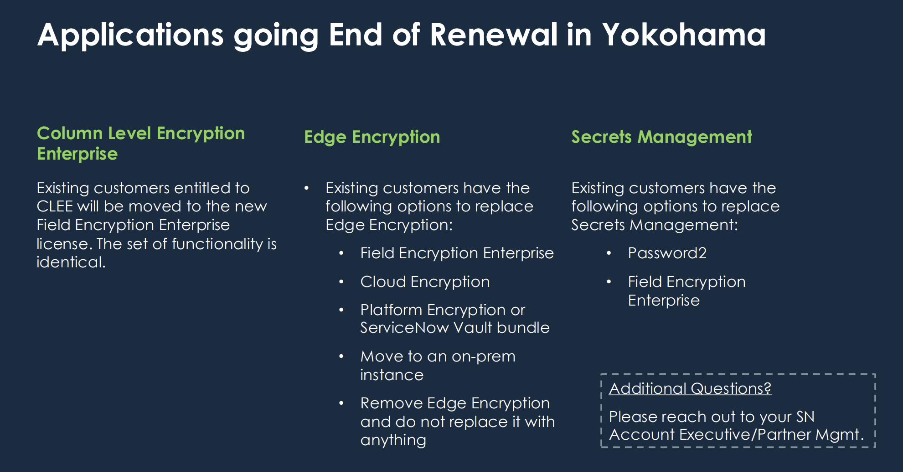

---
aliases:
  - "06 Case Study – Files"
area: "CTA"
source: notion-export
tags:
  - cta-program
  - encryption
  - scoped-apps
  - case-study
  - exam-prep
---

# Files

[QRG_Scoped Applications.pdf](Files/QRG_Scoped_Applications.pdf)

[QRG_Security Architecture.pdf](Files/QRG_Security_Architecture.pdf)

[Week 6 CTA Case Study.pdf](Files/Week_6_CTA_Case_Study.pdf)

[Week 6 presentation - NowArchitect_finaversion.pptx](Files/Week_6_presentation_-_NowArchitect_finaversion.pptx)

[week6_quizz.pptx](Files/week6_quizz.pptx)

[wp-data-encryption-with-servicenow.pdf](Files/wp-data-encryption-with-servicenow.pdf)

## Related
- [[06 Case Study – For PPT]]
- [[Introducing Sovereign Bank]]
- [[Text for slides]]

- [[06 Case Study]]
- [[06 Week 6]]
- [[Comparing ServiceNow encryption solutions]]