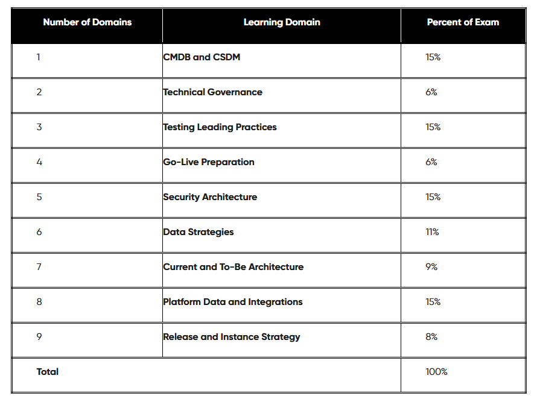

---
aliases:
  - "Exam"
area: "CTA"
source: notion-export
tags:
  - cta-program
  - capstone
  - exam-prep
  - cmdb
  - csdm
  - technical-governance
  - security-architecture
---

# Exam

https://www.pass4success.com/servicenow/exam/cta

[Cartões: ServiceNow CTA (Washington) Exam Guide Questions - USE THIS ONE | Quizlet](https://quizlet.com/961090978/servicenow-cta-washington-exam-guide-questions-use-this-one-flash-cards/)

[Clark_Burns | Quizlet](https://quizlet.com/user/Clark_Burns/sets)

[Quiz Maker for CTA 2025](https://www.classmarker.com/online-test/start/test-intro/?quiz=feg6814ce6b7b90d)

[Quiz Maker for CTA 2025 - AI generated](https://www.classmarker.com/online-test/start/test-intro/?quiz=t7r68270ca14fd33)
[Quiz Maker for CTA 2025 - AI generated - v2](https://www.classmarker.com/online-test/start/test-intro/?quiz=d4f68271837ec0f5)

[Quiz Maker for CTA 2025 - AI generated - v3](https://www.classmarker.com/online-test/start/test-intro/?quiz=nyh68344ded72f38)

- [ ]  CMDB and CSDM - week 2
- [ ]  Current and To-Be Architecture - week 3
- [ ]  Release and Instance Strategy - week 4
- [ ]  Technical Governance - week 4
- [ ]  Data Strategies - week 5
- [ ]  Security Architecture - week 6
- [ ]  Platform Data and Integrations - week 9
- [ ]  Testing Leading Practices - week 11
- [ ]  Go-Live Preparation - week 11

## CMDB and CSDM

1. A CMDB manager wants to ensure CIs are getting imported with all necessary fields, what KPI should be checked?
Answer: Completeness
2. An asset is being imported into the CMDB, what part of the IRE is used to determine if a new record is inserted?
Answer: Identification rule

## Technical Governance

1. What does Governance involve (select 3)?
Answer: What decisions need to be made, who is involved in decision making, how decisions are made
2. An implementation initiative needs to change portfolio/funding, which governance board needs to be consulted?
Answer: Executive Steering Board
3. What domains are covered by technical governance (select 3)?
Answer: Data Management, Environment Management, App Dev Management

## Release and Instance Strategy

1. What kinds of multi-development stacks are available (select 2)?
Answer: Split by Product, Split by Release
2. What are release methods are supported (select 3)?
Answer: App repo, Update Sets, Source Control
3. Benefits of defining instance management policies (select 3)?
Answer: Reducing risk, reducing MTTR, preventing incidents and outages

## Data Strategies

1. What is the recommended way to assign data ownership?
Answer: assign data owner by entity
2. What is Service Mapping user for (select 2)?
Answer: Service aware CMDB, represent CI relationships per application (can’t quite remember the answers for this one, but I think if you get the question you will know what the relevant options are)

## Security Architecture

1. What is used to identify and lower security risks?
Answer: Threat modeling
2. How do IP Access Controls work?
Answer: Part of the network layer, denies access to the application layer
3. What is used for encrypting data at rest
Answer: Database encryption/FDE
4. What is used for encrypting fields?
Answer: Platform encryption (this is the new name for CLE I believe)
5. Who can view data on the instance when edge encryption is utilized?
Answer: Users logged on through proxy server
6. What does the Instance Security Center show on the landing page?
Answer: Daily compliance score

## Platform Data and Integrations

1. What message is typically used with SSO?
Answer: SAML
2. What are spokes used for?
Answer: Reusable interaction with 3rd Party APIs

## Testing Leading Practices

1. What is used for repeatable execution of tests
Answer: ATF/automated testing
2. What is used for testing UX?
Answer: Usability testing
3. What is used for streamlining, creating, and managing the manual test process?
Answer: Test Management 2.0 (I got asked this same question twice :D)
4. What is the recommended method for regression testing?
Answer: ATF

## Go-Live Preparation

1. What do Go-Live communications focus on?
Answer: Sharing KBs, reinforcing training
2. What do you do if an application isn’t working after go-live?
Answer: disable the application while the issue is troubleshooted

## Mauricio questions

MID Server best practices, select 2

- Place near target

What its the function of SNC Access control plugins

what can you do with cmdb class manager select 3

which field determines the sso to use?

what secures data in transit in sso?

## Sample Questions

Sample Item #1
What ensures that the CMDB remains healthy and trustworthy?
1.	
A.	Manual data entry
B.	Automated population of data
C.	Regular user audits
D.	Weekly system reboots
Correct Answer: B

Sample Item #2
What does data management, as defined by the Technical Governance Board, primarily focus on within ServiceNow?
1.	
A.	Customization and configuration of applications
B.	Access policies for users
C.	Determining data ownership and accountability
D.	Defining instance structure and support model
Answer: C

Sample Item #3
Which type of non-functional testing provides stakeholders with information about the speed, stability, and scalability of their application?
1.	
A.	Documentation testing
B.	Performance testing
C.	Localization testing
D.	Security testing
Correct Answer: B

Sample Item #4
Which stage of the go-live process focuses on reinforcing training and building competency in the new system?
1.	
A.	Pre go-live communication
B.	Go-live communication
C.	Post go-live communication
D.	Hyper Care support
Correct Answer: B

Sample Item #5
What is the purpose of the SNC Access Control plugin in ServiceNow?
1.	
A.	To enhance data encryption
B.	To manage access by Technical Support personnel
C.	To streamline application development
D.	To enable user activity monitoring
Correct Answer: B

Sample Item #6
What function does the Robust Transform Engine (RTE) serve in ServiceNow’s data import process?
1.	
A.	Managing the deletion of outdated data records to clean up the CMDB.
B.	Isolating transform and processing functions to enhance performance.
C.	Standardizing data formats across systems to industry standards.
D.	Integrating external databases without resorting to transformation.
Correct Answer: B

Sample Item #7
What is the purpose of an architecture blueprint in ServiceNow?
1.	
A.	To outline the integration methods for third-party applications
B.	To provide a visual representation of the solution and its capabilities
C.	To describe the user roles and permissions in the system
D.	To specify the technical specifications for hardware
Correct Answer: B

Sample Item #8
Which type of integration involves making different applications and systems work together, typically through a middle layer to provide transactional data?
1.	
A.	Point-to-point integrations
B.	Database integrations
C.	Enterprise Service Bus (ESB)
D.	Application connectors
Correct Answer: C

Sample Item #9
What is the primary advantage of having a dedicated training instance in a ServiceNow environment?
1.	
A.	Reduces overall development costs for the organization
B.	Prevents disruptions in the development cycle of the platform
C.	Improves the overall network security for all instances
D.	Reduces the total number of needed instances overall
Correct Answer: B

[Exam questions - per topics](Exam/Exam%20questions%20-%20per%20topics%201f6c42ce9a56805da84ad043c8058973.md)

[CMDB and CSDM](Exam/CMDB%20and%20CSDM%201e4c42ce9a5680369b54e40c12c791a1.md)

[TO REVIEW FOR EXAM](Exam/TO%20REVIEW%20FOR%20EXAM%20206c42ce9a5680b7807dd0dd07988d96.md)

## Related
- [[Real questions]]
- [[ChatGPT Sample Questions]]
- [[CTA Exam Scope]]
- [[12 Capstone Assessment]]
- [[CMDB and CSDM]]
- [[Exam questions - per topics]]
- [[TO REVIEW FOR EXAM]]
- [[CMDB]]