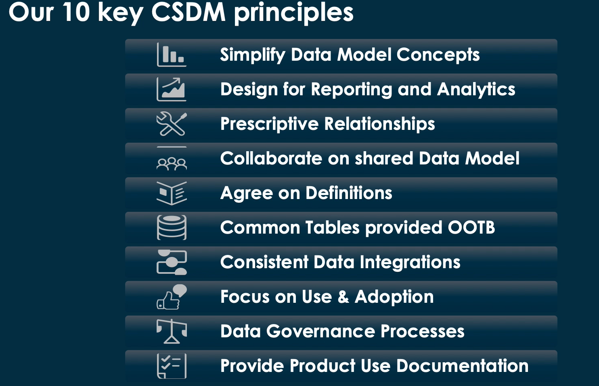

---
aliases:
  - "CSDM"
tags:
  - cta-program
  - exam-prep
  - csdm
  - cmdb
---

# CSDM

[Identifying a case study](CSDM/Identifying%20a%20case%20study%20184c42ce9a568042bbe2dedeb7bb5945.md)

**Common Service Data Model (CSDM) in ServiceNow: Comprehensive Guide for Case Study Analysis**

## What is the CSDM explained—Aligning IT to business strategy?

A reactive approach to digital products and delivery can dominate without an IT focus on standardization, integration, and application of a common approach. CSDM helps you connect terminology to help make decisions for strategy, planning, developing, troubleshooting, root cause analysis, and executing changes.

## CSDM is all about doing CMDB right

CMDB is considered the best practice for [CSDM](https://www.servicenow.com/products/it-operations-management/what-is-cmdb.html) modeling and management—it provides direction on modeling and comes with a standardized set of definitions. It is a connection between business and technical perspectives with mapping and relationships. It provides visibility into application and service data from varying domains, consolidating everything into a single view. This gives your organization the opportunity to align your IT and company strategies. CMDB with a high-quality CSDM also provides multiple benefits like faster incident resolutions, better security, and better judgment of the impact of change.

## What are the phases of CSDM?

### Foundation phase

The foundation phase's main objective is to establish a solid groundwork for accurate reporting and data management. This means defining essential terms and categorizing data elements within the CMDB. By setting up a reliable data foundation, your organization paves the way for more advanced phases of CSDM implementation.

### Crawl phase

During the crawl phase, the focus shifts toward application tables to meet basic management needs within the CMDB. Tasks in this phase include creating minimum data structures necessary for incident, change, and problem management. Establishing these basic management functionalities allows organizations to effectively track and manage IT-related incidents—and updates.

### Walk phase

The third phase of CSDM implementation revolves around managing and supporting deployed infrastructure more fully. This phase often entails enhancing infrastructure management capabilities and providing reliable support services. Taking the time to address infrastructure management challenges helps organizations boost operational efficiency and reliability across their IT systems.

### Run phase

As you progress to the run phrase, the focus again shifts, this time toward incorporating business services into the CMDB. This helps teams understand the impact of different technology on business operations. During the run phase, efforts are focused on integrating business services with the underlying technology infrastructure to gain deeper insights into how technology supports and influences various business processes.

### Fly phase

The final phase of CSDM implementation is the fly phase, where all aspects of the model are fully integrated to achieve comprehensive business and IT alignment. This phase involves completing any remaining CSDM elements to align technology and business services with overall capabilities. The outcomes typically include improved quality and lower costs.

## What is the CSDM not?

CSDM is a powerful framework for CMDB data modeling and management, providing essential guidance and visibility. But it does have its limitations. Getting the most out of CSDM means recognizing what it can—and can’t—do for your business. Here are several things that CSDM is not:

- A SKU or product to be purchased
- One-size-fits-all guide to define application or business services
- An automated fix for models in prior implementations
- Code to be installed
- Implementation guide for EM, ITSM, [APM](https://www.servicenow.com/products/strategic-portfolio-management/what-is-application-portfolio-management.html), and [SPM](https://www.servicenow.com/products/strategic-portfolio-management/what-is-spm.html)
- A set of reports

ServiceNow provides all CSDM objectives and the CMDB tables as a part of the out-of-the-box CMDB product, regardless of licensing.

## Why should you follow the CSDM?

Products from ServiceNow that use the CMDB deliver better benefits faster when using the CSDM. Adopting it will ensure that:

- You will be able to take better advantage of ServiceNow products
- Upgrading will be an easier, more straightforward process
- ServiceNow products will work better in conjunction with common definitions across the product portfolio

Use of CSDM will also provide transparent reporting and service costing, in addition to reduced overhead from services maintenance.

## How does CSDM relate to reports?

You can use the CMDB builder to generate reports that show CMDB items and their relationships. Most of CSDM follows CMDB, which includes:

- Business capability
- Information object
- Service
- Business application
- Application service
- Service offering

## What are the benefits of the CSDM?

### Improved data mapping and organization

The common services data model can act as a blueprint for mapping IT services on the ServiceNow platform. It provides a structured CMDB-based framework that outlines precisely where data should be placed for other products in use. By adhering to the CSDM framework, organizations can ensure that data within applications aligns accurately with the corresponding CMDB tables. This alignment minimizes the occurrence of duplicate, incorrect, and out-of-date data for improved quality and reliability.

### Standardization and minimized data issues

CSDM also acts as a standard for ServiceNow products utilizing CMDB functionalities. By adopting the CSDM framework, organizations benefit from a standardized approach to data modeling and management. This standardization reduces the complexity of data structures and ensures consistency in how data is organized and accessed across different ServiceNow products. As a result, your organization will experience fewer data issues, such as discrepancies or data integrity problems, leading to smoother operations.

## What are the challenges of CSDM?

While CSDM provides certain clear advantages, some organizations find themselves poorly prepared to get the most out of the common services data model. When this happens, the issue can usually be traced back to one or more of the following problems:

### Poor architectural alignment with CMDB

One common challenge is the lack of proper alignment between the CSDM framework and the CMDB. Without a well-aligned architecture, organizations may struggle to integrate CSDM effectively into their existing IT infrastructure, leading to inefficiencies and data management issues.

### Lack of IT ILSM principles

Another challenge arises from a deficiency in IT Infrastructure Library Service Management (ILSM) principles. Without effective ILSM practices in place, your organization may find it challenging to implement and maintain the CSDM framework effectively. This can result in poor utilization of CSDM's capabilities and hinder overall IT service management efficiency.

### Undefined formal services

When organizations fail to formally define their services within the CSDM framework, it can lead to confusion and inefficiencies. Undefined services make it difficult to map data accurately and establish clear relationships between IT assets and services, impacting decision-making and operational effectiveness.

### Segmented data ownership and limited collaboration

Segmented data ownership and limited collaboration among stakeholders can create silos within the organization, making it challenging to implement CSDM comprehensively. Siloed data ownership inhibits data sharing and integration efforts, hindering the seamless adoption of CSDM across departments and teams.

### Unmaintainable CMDB customizations

Prior customization of the CMDB data, particularly in classifying Configuration Items (CIs) and their relationships with organizational products, services, and capabilities, can also pose a significant challenge. Unmaintainable customizations often lead to data inconsistencies, making it harder to align with the CSDM framework and undermining its intended benefits.

## How can you get started with CSDM?

Embarking on the implementation of the Common Service Data Model (CSDM) requires a strategic and phased approach to maximize its effectiveness. It is essential to avoid attempting to implement every CSDM element simultaneously.

Instead, adopt a staged implementation strategy that aligns with your organization's priorities and needs. ServiceNow outlines the five key stages for implementing CSDM, each serving a specific purpose, from the foundation phase through to the fly phase. By following this staged approach, your organization can effectively leverage the benefits of CSDM while mitigating challenges and ensuring a successful implementation journey.

## How do I migrate CSDM-related data to the recommended tables?

## Related
- [[Topics for Pre-study]]
- [[Identifying a case study]]
- [[CMDB]]
- [[CMDB and CSDM]]
- [[CMDB CSDM]]