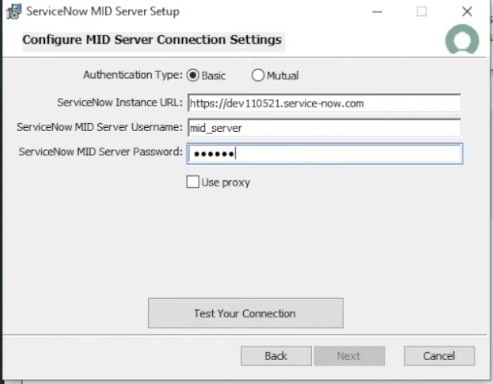

---
aliases:
  - "Installation"
tags:
  - mid-server
  - installation
  - windows
---

# Installation

- [ ]  Access the machine where the mid server will be installed
- [ ]  Mid Server > Downloads > download the appropriate file
- [ ]  Create the mid server user or use one that is already created
- [ ]  Give or check if the user has the mid_server role
- [ ]  On Local Disc (in the target machine), create a folder called Mid Server
- [ ]  On that folder, paste the downloaded file and install on that folder (you need admin rights for that)

| If that doesn’t work, change the name of the file to "mid_setup", open the cmd as admin and run the file on the cmd | Go to folder, exemple:
 
 msiexec /I mid_setup |
| --- | --- |
- [ ]  Use the mid server credentials here

| On this step, you need to do some intermediate steps first. | Mid server name suggestion:
 MidserverPRD3_EventMngt
or
 MidserverPRD3 |
| --- | --- |

- [ ]  To get the service account name, search "this pc" (on the target machine) and do right click > Manage

- [ ]  Go to Local Users and Groups and add a new user

| Save the password | Suggestion:  event789mngt$ |
| --- | --- |
- [ ]  Go to Local Security Policy

- [ ]  Go to User Rights Assignment

- [ ]  Search the "log on as a service" > add User or Group
- [ ]  Add the user name that you created, and click Check names

Go back to this, and add the username and password that you created

- [ ]  Once is validated, click next and install the mid on the folder you created
- [ ]  Check "Start MID Server after installation"
- [ ]  Now go to the folder, search for "installer" > run as admin OR start OR confirm its running

- [ ]  The mid server name and password that its going to ask, it’s the ServiceNow one
- [ ]  After a few minutes, go to ServiceNow > Servers > Check the mid Server there
- [ ]  You can exit the message on the machine
- [ ]  Validate midserver on ServiceNow

## Related

- [[Mid Server]]
- [[Run Commands on Mid Servers]]
- [[How to import a CSV file from a Mid Server]]