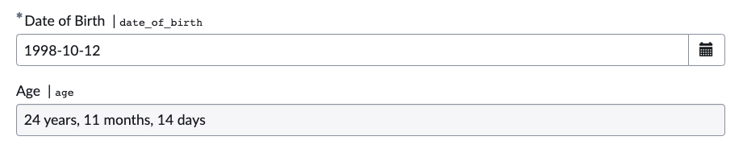

# Age Calculator - On Change Client Script

This script is designed to calculate a person's age based on their date of birth.

## Functions

- `calculateAge(dateOfBirth)`: Calculates the age in years, months, and days based on the provided date of birth.
- `calculateAgeDifference(startDate, endDate)`: Computes the difference in years, months, and days between two dates.

## Sample Input and Output

## Related Notes

- [[ServiceNowOfficialDocs/servicenow-dev-program/code-snippets/Client-Side Components/Catalog Client Script/Add Label For Attachment/README|Add Label For Attachment]]
- [[ServiceNowOfficialDocs/servicenow-dev-program/code-snippets/Client-Side Components/Catalog Client Script/Add Rows in MRVS/README|Add Rows in MRVS]]
- [[ServiceNowOfficialDocs/servicenow-dev-program/code-snippets/Client-Side Components/Catalog Client Script/Auto Save Draft Feature/README|Auto Save Draft Feature]]
- [[ServiceNowOfficialDocs/servicenow-dev-program/code-snippets/Client-Side Components/Catalog Client Script/Auto-populate field from URL/README|Auto-populate field from URL]]
- [[ServiceNowOfficialDocs/servicenow-dev-program/code-snippets/Client-Side Components/Catalog Client Script/Autofilling the request details from previous request/Readme|Autofilling the request details from previous request]]
- [[ServiceNowOfficialDocs/servicenow-dev-program/code-snippets/Client-Side Components/Catalog Client Script/Autopopulate Department/README|Autopopulate Department]]
