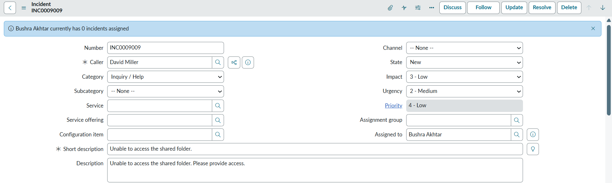
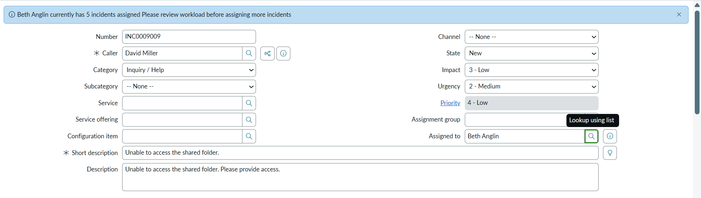

## Display Info Message of Incident Count of Assigned-To User When Field Assigned-To Changes

Displays a message showing the count of **open incidents** assigned to a user whenever the **Assigned To** field changes on the Incident form.  

- Helps assess the assignee’s **current workload** by fetching and displaying active incident counts (excluding *Resolved*, *Closed*, and *Canceled* states)
- Shows an **info message** with the count of the assignee's assigned incidents
- Uses an **onChange Client Script** on the **Assigned To** field and a **GlideAjax Script Include** called from the client script to fetch the count dynamically

---

### Info Message Example 1  

### Info Message Example 2  

---

## Related Notes

- [[ServiceNowOfficialDocs/servicenow-dev-program/code-snippets/Client-Side Components/Client Scripts/Abort action when description is empty/ReadMe|Abort action when description is empty]]
- [[ServiceNowOfficialDocs/servicenow-dev-program/code-snippets/Client-Side Components/Client Scripts/Abort direct incident closure without Resolve State/readme|Abort direct incident closure without Resolve State]]
- [[ServiceNowOfficialDocs/servicenow-dev-program/code-snippets/Client-Side Components/Client Scripts/Add Field Decoration/README|Add Field Decoration]]
- [[ServiceNowOfficialDocs/servicenow-dev-program/code-snippets/Client-Side Components/Client Scripts/Add Image to Field Based on Company/README|Add Image to Field Based on Company]]
- [[ServiceNowOfficialDocs/servicenow-dev-program/code-snippets/Client-Side Components/Client Scripts/Adding Placeholder on Resolution Notes/README|Adding Placeholder on Resolution Notes]]
- [[ServiceNowOfficialDocs/servicenow-dev-program/code-snippets/Client-Side Components/Client Scripts/Auto Update Priority based on Impact and Urgency/readme|Auto Update Priority based on Impact and Urgency]]
