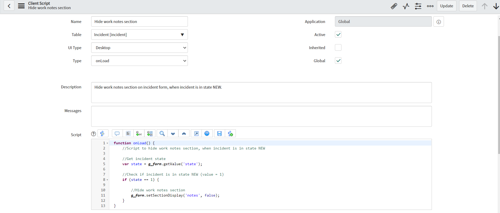
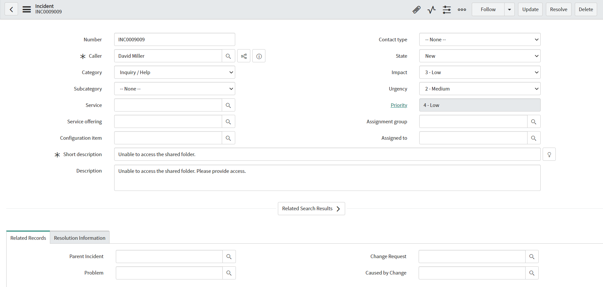
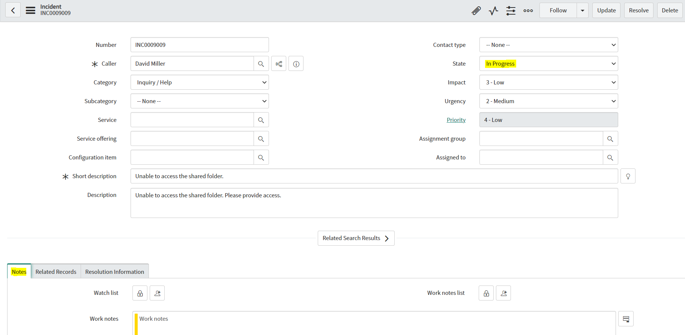

**Client Script**

Client Script for hiding work notes section on incident form. In this example it is configured to hide work notes section, when incident is in state new, but you can adjust condition to fit your requirements. 

**Example configuration of Client Script**

**Example effect of execution**

When incident is in state NEW (Work notes section not visible):

When incident is not in state NEW (Work notes section visible):

## Related Notes

- [[ServiceNowOfficialDocs/servicenow-dev-program/code-snippets/Client-Side Components/Client Scripts/Abort action when description is empty/ReadMe|Abort action when description is empty]]
- [[ServiceNowOfficialDocs/servicenow-dev-program/code-snippets/Client-Side Components/Client Scripts/Abort direct incident closure without Resolve State/readme|Abort direct incident closure without Resolve State]]
- [[ServiceNowOfficialDocs/servicenow-dev-program/code-snippets/Client-Side Components/Client Scripts/Add Field Decoration/README|Add Field Decoration]]
- [[ServiceNowOfficialDocs/servicenow-dev-program/code-snippets/Client-Side Components/Client Scripts/Add Image to Field Based on Company/README|Add Image to Field Based on Company]]
- [[ServiceNowOfficialDocs/servicenow-dev-program/code-snippets/Client-Side Components/Client Scripts/Adding Placeholder on Resolution Notes/README|Adding Placeholder on Resolution Notes]]
- [[ServiceNowOfficialDocs/servicenow-dev-program/code-snippets/Client-Side Components/Client Scripts/Auto Update Priority based on Impact and Urgency/readme|Auto Update Priority based on Impact and Urgency]]
