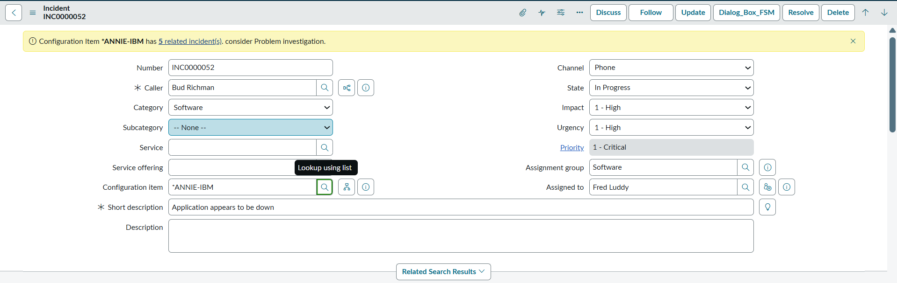
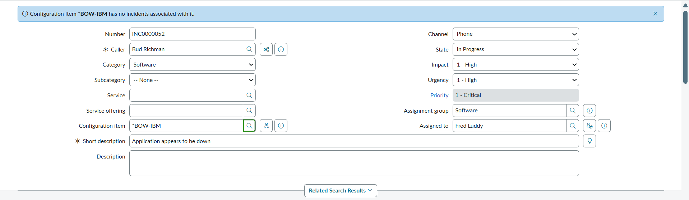
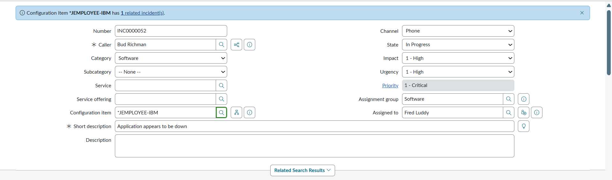
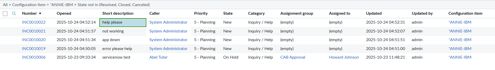

# Incident Count of Selected Configuration Item with Info Message and Link to its Related Incident 

Displays a message showing the count of open incidents associated with a selected **Configuration Item (CI)** whenever the **Configuration Item** field changes on the Incident form.

- Helps quickly identify whether the selected CI has existing incident by fetching and displaying active incident counts (excluding *Resolved*, *Closed*, and *Canceled* states).  
- Shows an **info message** with a **clickable link** that opens a filtered list of related incidents for that CI  
- If more than five incidents are linked, a **warning message** appears suggesting Problem investigation for frequent or repeated CI issues.
- Uses an **onChange Client Script** on the *Configuration Item* field and a **GlideAjax Script Include** called from the client script to fetch the incident count  

---

## Warning Message displayed on form when CI has 5 or more incidents 

---

## Info Message displayed on form when CI has no incidents

---

## Info Message displayed on form when CI has incidents less than 5

---

## Upon clicking the url link filter list opens with incidents associated with CI

---

## Related Notes

- [[ServiceNowOfficialDocs/servicenow-dev-program/code-snippets/Client-Side Components/Client Scripts/Abort action when description is empty/ReadMe|Abort action when description is empty]]
- [[ServiceNowOfficialDocs/servicenow-dev-program/code-snippets/Client-Side Components/Client Scripts/Abort direct incident closure without Resolve State/readme|Abort direct incident closure without Resolve State]]
- [[ServiceNowOfficialDocs/servicenow-dev-program/code-snippets/Client-Side Components/Client Scripts/Add Field Decoration/README|Add Field Decoration]]
- [[ServiceNowOfficialDocs/servicenow-dev-program/code-snippets/Client-Side Components/Client Scripts/Add Image to Field Based on Company/README|Add Image to Field Based on Company]]
- [[ServiceNowOfficialDocs/servicenow-dev-program/code-snippets/Client-Side Components/Client Scripts/Adding Placeholder on Resolution Notes/README|Adding Placeholder on Resolution Notes]]
- [[ServiceNowOfficialDocs/servicenow-dev-program/code-snippets/Client-Side Components/Client Scripts/Auto Update Priority based on Impact and Urgency/readme|Auto Update Priority based on Impact and Urgency]]
