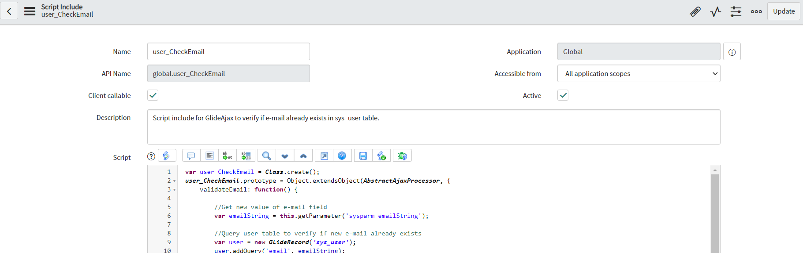
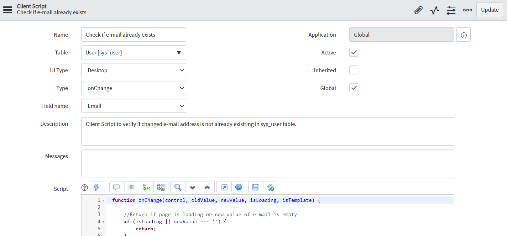
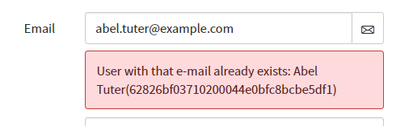

**Client Script**

Client script for verification if changed e-mail adders on user record is not already existing in sys_user table (real-time information about duplicated e-mail). Check is performed using asynchronous Ajax call and processed in callback function. In case e-mail already exists in sys_user table, message is displayed under email field with information which has have that e-mail.

**How to use**

You need to prepare both Script Include (which is processing check on backed) and Client Script (which is sending Ajax call after change on email field and display message).

Example Script Include configuration (code in [scriptInclude.js](scriptInclude.js)):

Example Client Script configuration (code in [clientScript.js](clientScript.js)):

**Example effect of execution**

## Related Notes

- [[ServiceNowOfficialDocs/servicenow-dev-program/code-snippets/Client-Side Components/Client Scripts/Abort action when description is empty/ReadMe|Abort action when description is empty]]
- [[ServiceNowOfficialDocs/servicenow-dev-program/code-snippets/Client-Side Components/Client Scripts/Abort direct incident closure without Resolve State/readme|Abort direct incident closure without Resolve State]]
- [[ServiceNowOfficialDocs/servicenow-dev-program/code-snippets/Client-Side Components/Client Scripts/Add Field Decoration/README|Add Field Decoration]]
- [[ServiceNowOfficialDocs/servicenow-dev-program/code-snippets/Client-Side Components/Client Scripts/Add Image to Field Based on Company/README|Add Image to Field Based on Company]]
- [[ServiceNowOfficialDocs/servicenow-dev-program/code-snippets/Client-Side Components/Client Scripts/Adding Placeholder on Resolution Notes/README|Adding Placeholder on Resolution Notes]]
- [[ServiceNowOfficialDocs/servicenow-dev-program/code-snippets/Client-Side Components/Client Scripts/Auto Update Priority based on Impact and Urgency/readme|Auto Update Priority based on Impact and Urgency]]
