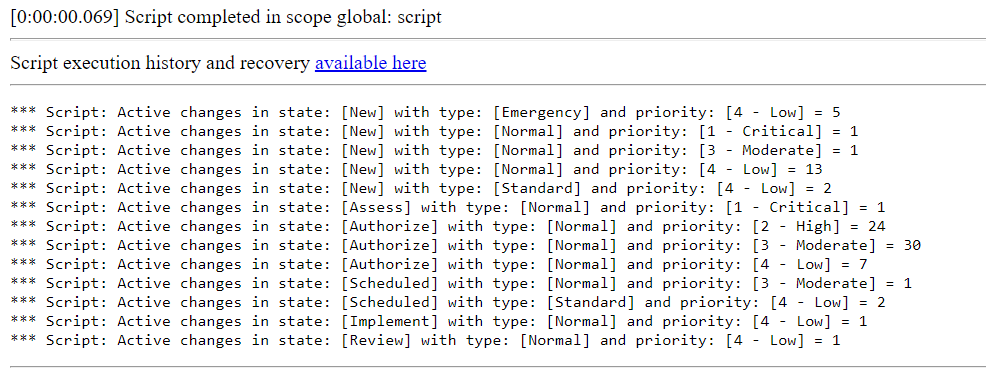

**GlideAggregate**

Script which allows to group by three columns (you can expand or decrease number of columns to fit your needs). In this example, the script allows counting number of active changes grouped by state, type and priority fields.

Special thanks to *SN-AJB* for his post about GlideAggregate: https://developer.servicenow.com/blog.do?p=/post/glideaggregate/. Absolutely worth taking a look!

**Example execution logs**

## Related Notes

- [[ServiceNowOfficialDocs/servicenow-dev-program/code-snippets/Core ServiceNow APIs/GlideAggregate/Count All Open Incidents Per Priority/readme|Count All Open Incidents Per Priority]]
- [[ServiceNowOfficialDocs/servicenow-dev-program/code-snippets/Core ServiceNow APIs/GlideAggregate/Count Inactive Users with Active incidents/README|Count Inactive Users with Active incidents]]
- [[ServiceNowOfficialDocs/servicenow-dev-program/code-snippets/Core ServiceNow APIs/GlideAggregate/Count incidents based on category/README|Count incidents based on category]]
- [[ServiceNowOfficialDocs/servicenow-dev-program/code-snippets/Core ServiceNow APIs/GlideAggregate/Count open Incidents per Priority and State using GlideAggregate/README|Count open Incidents per Priority and State using GlideAggregate]]
- [[ServiceNowOfficialDocs/servicenow-dev-program/code-snippets/Core ServiceNow APIs/GlideAggregate/Create Problem based on incident volume/README|Create Problem based on incident volume]]
- [[ServiceNowOfficialDocs/servicenow-dev-program/code-snippets/Core ServiceNow APIs/GlideAggregate/Find Oldest Open Incidents per Group/README|Find Oldest Open Incidents per Group]]
