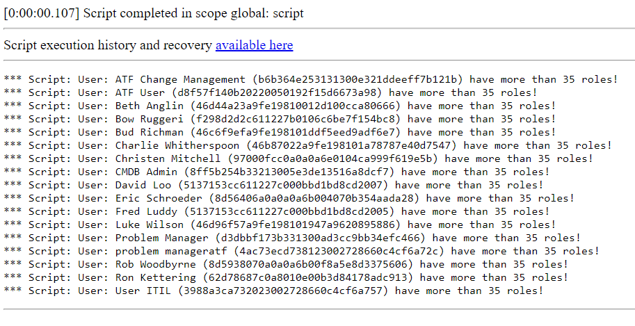

**GlideAggregate**

Script which shows how to use addHaving() function, which allows adding conditions on aggregate functions. In this example, the script will show which users have more than 35 roles assignments in sys_user_has_role table. You can use it also in different scenarios, modifying the table and other conditions.

Function addHaving() can not be used in Scoped Applications!

**Example execution logs**

## Related Notes

- [[ServiceNowOfficialDocs/servicenow-dev-program/code-snippets/Core ServiceNow APIs/GlideAggregate/Count All Open Incidents Per Priority/readme|Count All Open Incidents Per Priority]]
- [[ServiceNowOfficialDocs/servicenow-dev-program/code-snippets/Core ServiceNow APIs/GlideAggregate/Count Inactive Users with Active incidents/README|Count Inactive Users with Active incidents]]
- [[ServiceNowOfficialDocs/servicenow-dev-program/code-snippets/Core ServiceNow APIs/GlideAggregate/Count incidents based on category/README|Count incidents based on category]]
- [[ServiceNowOfficialDocs/servicenow-dev-program/code-snippets/Core ServiceNow APIs/GlideAggregate/Count open Incidents per Priority and State using GlideAggregate/README|Count open Incidents per Priority and State using GlideAggregate]]
- [[ServiceNowOfficialDocs/servicenow-dev-program/code-snippets/Core ServiceNow APIs/GlideAggregate/Create Problem based on incident volume/README|Create Problem based on incident volume]]
- [[ServiceNowOfficialDocs/servicenow-dev-program/code-snippets/Core ServiceNow APIs/GlideAggregate/Find Oldest Open Incidents per Group/README|Find Oldest Open Incidents per Group]]
