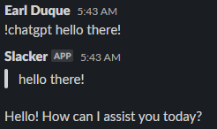

- Make sure you have a key stored in a system property named `openai.key`
- Quick script to do a `gpt-3.5-turbo` chatgpt call
- If you set `show_tokens` to true then it will also show the estimated cost of the prompt+response

Example usage:

## Related Notes

- [[ServiceNowOfficialDocs/servicenow-dev-program/code-snippets/Client-Side Components/UI Actions/Open Record in Alternate Instance/Scripted REST API/sys_ws_definition_config|sys_ws_definition_config]]
- [[ServiceNowOfficialDocs/servicenow-dev-program/code-snippets/Client-Side Components/UI Actions/Open Record in Alternate Instance/Scripted REST API/sys_ws_operation/sys_ws_operation_config|sys_ws_operation_config]]
- [[ServiceNowOfficialDocs/servicenow-dev-program/code-snippets/Integration/Scripted REST Api/Approval APIs/README|Approval APIs]]
- [[ServiceNowOfficialDocs/servicenow-dev-program/code-snippets/Integration/Scripted REST Api/Approval on Behalf/README|Approval on Behalf]]
- [[ServiceNowOfficialDocs/servicenow-dev-program/code-snippets/Integration/Scripted REST Api/CMDB API/README|CMDB API]]
- [[ServiceNowOfficialDocs/servicenow-dev-program/code-snippets/Integration/Scripted REST Api/CURL Script to create incident via tableAPI/README|CURL Script to create incident via tableAPI]]
