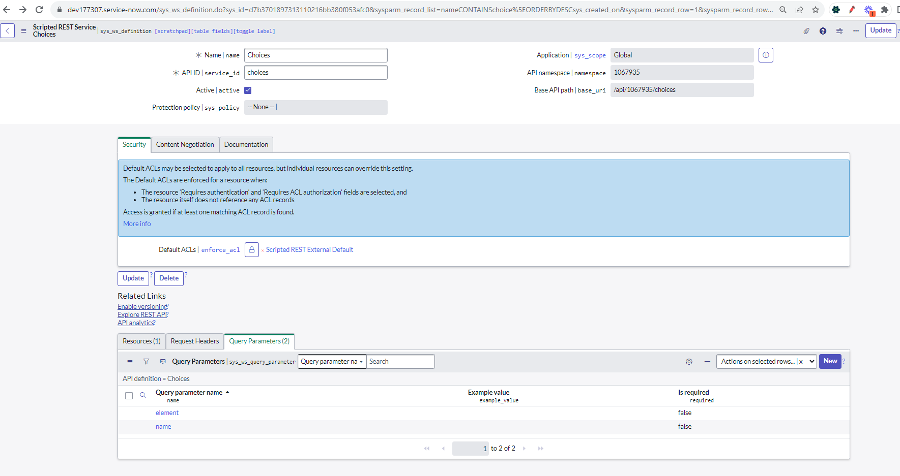
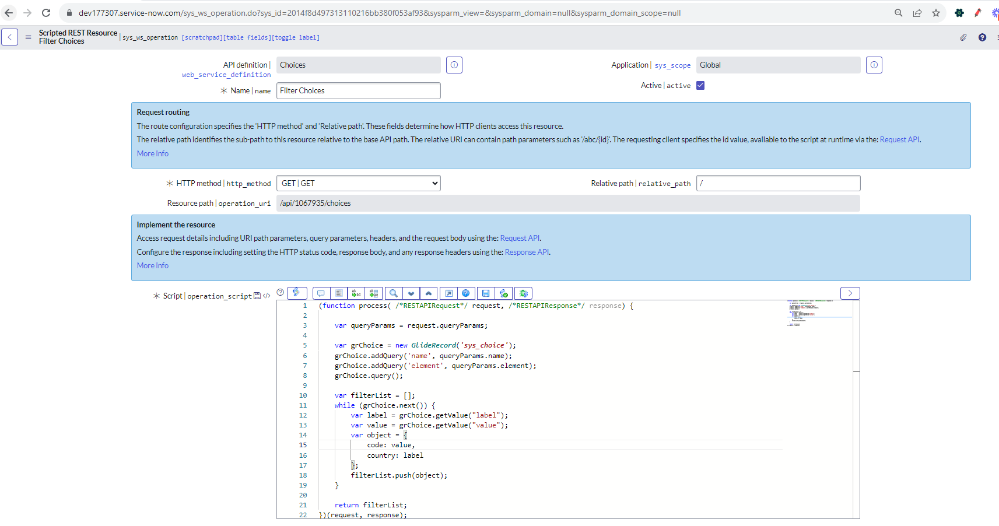

# This code will help to query choice table and get the data according to filter. Modify this according to requirement
# References 
- Below is the reference of PDI, what is the configuration of choices

- Below is the referecnce of PDI resources of Script

## Related Notes

- [[ServiceNowOfficialDocs/servicenow-dev-program/code-snippets/Client-Side Components/UI Actions/Open Record in Alternate Instance/Scripted REST API/sys_ws_definition_config|sys_ws_definition_config]]
- [[ServiceNowOfficialDocs/servicenow-dev-program/code-snippets/Client-Side Components/UI Actions/Open Record in Alternate Instance/Scripted REST API/sys_ws_operation/sys_ws_operation_config|sys_ws_operation_config]]
- [[ServiceNowOfficialDocs/servicenow-dev-program/code-snippets/Integration/Scripted REST Api/Approval APIs/README|Approval APIs]]
- [[ServiceNowOfficialDocs/servicenow-dev-program/code-snippets/Integration/Scripted REST Api/Approval on Behalf/README|Approval on Behalf]]
- [[ServiceNowOfficialDocs/servicenow-dev-program/code-snippets/Integration/Scripted REST Api/CMDB API/README|CMDB API]]
- [[ServiceNowOfficialDocs/servicenow-dev-program/code-snippets/Integration/Scripted REST Api/CURL Script to create incident via tableAPI/README|CURL Script to create incident via tableAPI]]
