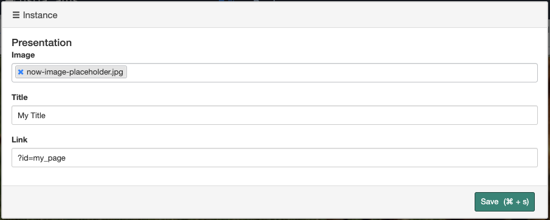
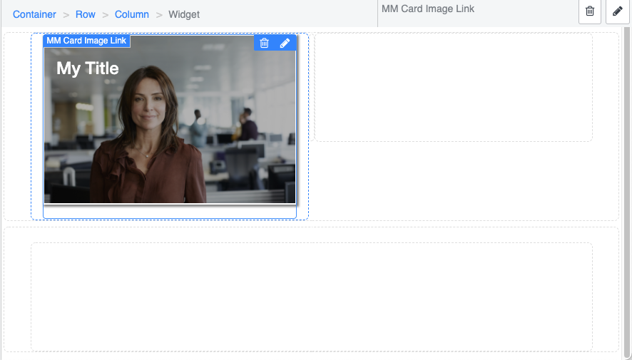

# Card Image Link Widget

Provides an easy to use and nice looking card widget to add to Service Portal pages

# Set up 

# End Result

## Related Notes

- [[ServiceNowOfficialDocs/servicenow-dev-program/code-snippets/Modern Development/Service Portal Widgets/Accordion Widget/README|Accordion Widget]]
- [[ServiceNowOfficialDocs/servicenow-dev-program/code-snippets/Modern Development/Service Portal Widgets/AngularJS Directives and Filters/README|AngularJS Directives and Filters]]
- [[ServiceNowOfficialDocs/servicenow-dev-program/code-snippets/Modern Development/Service Portal Widgets/Animated Notification Badge/README|Animated Notification Badge]]
- [[ServiceNowOfficialDocs/servicenow-dev-program/code-snippets/Modern Development/Service Portal Widgets/ApplyCSSDynamically/README|ApplyCSSDynamically]]
- [[ServiceNowOfficialDocs/servicenow-dev-program/code-snippets/Modern Development/Service Portal Widgets/Batman Animation/README|Batman Animation]]
- [[ServiceNowOfficialDocs/servicenow-dev-program/code-snippets/Modern Development/Service Portal Widgets/Calendar widget/README|Calendar widget]]
