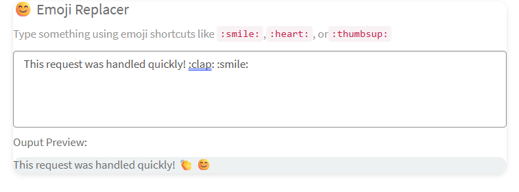

## Emoji Replacer Widget

This widget enhances the user experience by automatically converting emojis code into visual emojis while typing - adding personality and clarity to text communication.
## How It works
- User types in a text box:
- "Great job team!:tada::thumbsup:"
- Script will detects matching emoji code using regex.
- The widget replaces them with real emojis:
- "Great job team!🎉👍
## Available Emoji in Widget
 ":smile:" :😊,
   ":sad:":😓,
	  ":heart:":❤️,
		":thumbsup:":👍,
		":laugh:":😀,
		":wink:":😉,
		":clap:":👏,
		":party:":🥳,
		":tada:":🎉
## Output

## Related Notes

- [[ServiceNowOfficialDocs/servicenow-dev-program/code-snippets/Modern Development/Service Portal Widgets/Accordion Widget/README|Accordion Widget]]
- [[ServiceNowOfficialDocs/servicenow-dev-program/code-snippets/Modern Development/Service Portal Widgets/AngularJS Directives and Filters/README|AngularJS Directives and Filters]]
- [[ServiceNowOfficialDocs/servicenow-dev-program/code-snippets/Modern Development/Service Portal Widgets/Animated Notification Badge/README|Animated Notification Badge]]
- [[ServiceNowOfficialDocs/servicenow-dev-program/code-snippets/Modern Development/Service Portal Widgets/ApplyCSSDynamically/README|ApplyCSSDynamically]]
- [[ServiceNowOfficialDocs/servicenow-dev-program/code-snippets/Modern Development/Service Portal Widgets/Batman Animation/README|Batman Animation]]
- [[ServiceNowOfficialDocs/servicenow-dev-program/code-snippets/Modern Development/Service Portal Widgets/Calendar widget/README|Calendar widget]]
