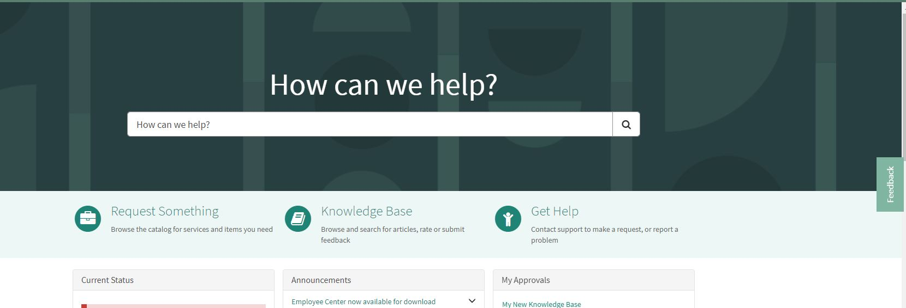

## Floater Feedback Widget

The attached widget can be used to have a floating link widget on the portal homepage when clicks opens a specific catalog item or a record producer. 
This can be used to gather feedback using a catalog item or create incidents from the portal.

Simply add this widget to the portal homepage anywhere and you can find this present on the side of the homepage. Refer screenshot.

*Note: You need to update the sys_id of your catalog item. Refer HTML in the .js widget file.*

## Related Notes

- [[ServiceNowOfficialDocs/servicenow-dev-program/code-snippets/Modern Development/Service Portal Widgets/Accordion Widget/README|Accordion Widget]]
- [[ServiceNowOfficialDocs/servicenow-dev-program/code-snippets/Modern Development/Service Portal Widgets/AngularJS Directives and Filters/README|AngularJS Directives and Filters]]
- [[ServiceNowOfficialDocs/servicenow-dev-program/code-snippets/Modern Development/Service Portal Widgets/Animated Notification Badge/README|Animated Notification Badge]]
- [[ServiceNowOfficialDocs/servicenow-dev-program/code-snippets/Modern Development/Service Portal Widgets/ApplyCSSDynamically/README|ApplyCSSDynamically]]
- [[ServiceNowOfficialDocs/servicenow-dev-program/code-snippets/Modern Development/Service Portal Widgets/Batman Animation/README|Batman Animation]]
- [[ServiceNowOfficialDocs/servicenow-dev-program/code-snippets/Modern Development/Service Portal Widgets/Calendar widget/README|Calendar widget]]
