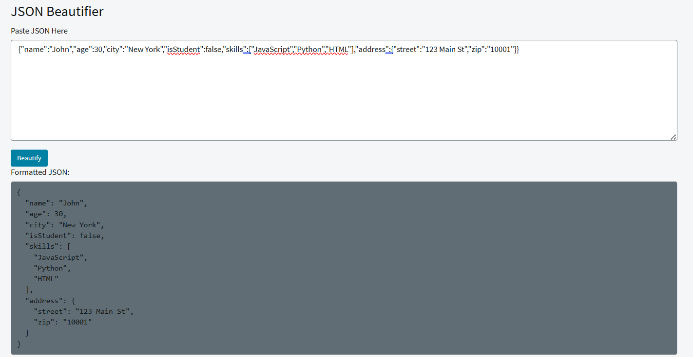

## JSON Beautifier Widget

The JSON Beautifier widget is a developer-focused tool designed to make working with JSON in ServiceNow fast, easy and efficient. It helps admins, developers and testers handles JSON payloads from APIs, Integration etc.

## Benefits
- Reduces time spent manually formatting or checking JSON.
- Helps identify error or differences between JSOn payload quickly
  
## Output

## Related Notes

- [[ServiceNowOfficialDocs/servicenow-dev-program/code-snippets/Modern Development/Service Portal Widgets/Accordion Widget/README|Accordion Widget]]
- [[ServiceNowOfficialDocs/servicenow-dev-program/code-snippets/Modern Development/Service Portal Widgets/AngularJS Directives and Filters/README|AngularJS Directives and Filters]]
- [[ServiceNowOfficialDocs/servicenow-dev-program/code-snippets/Modern Development/Service Portal Widgets/Animated Notification Badge/README|Animated Notification Badge]]
- [[ServiceNowOfficialDocs/servicenow-dev-program/code-snippets/Modern Development/Service Portal Widgets/ApplyCSSDynamically/README|ApplyCSSDynamically]]
- [[ServiceNowOfficialDocs/servicenow-dev-program/code-snippets/Modern Development/Service Portal Widgets/Batman Animation/README|Batman Animation]]
- [[ServiceNowOfficialDocs/servicenow-dev-program/code-snippets/Modern Development/Service Portal Widgets/Calendar widget/README|Calendar widget]]
