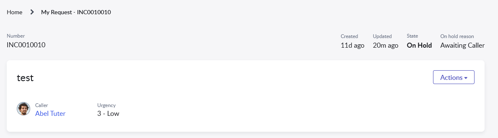

# Ticket header with on hold reason
A simple wrapper widget that enhances the OOTB ticket header widget and displays additional On Hold Reason field if there is any.



## HTML
```html
<sp-widget widget="c.data.headerTicketWidget"></sp-widget>
```
## Client Controller
```javascript
api.controller=function($scope, spUtil, $location) {
	/* widget controller */
	var c = this;
	var urlParams = $location.search();
	spUtil.recordWatch($scope, urlParams.table, 'sys_id=' + urlParams.sys_id, function(){
        c.server.refresh();
    });	
};
```

## Server Script
```javascript
(function() {
	data.headerTicketWidget = $sp.getWidget('standard_ticket_header');
	
	var tableName = $sp.getParameter('table');
	var sysId = $sp.getParameter('sys_id');

	if (tableName != 'incident'){
		return;
	}
	var recordGR = new GlideRecord(tableName);
	if (recordGR.get(sysId)){
		var holdReasonField = $sp.getField(recordGR, 'hold_reason');
		data.headerTicketWidget.data.headerFields.push(holdReasonField);
	}
})();
```

## Related Notes

- [[ServiceNowOfficialDocs/servicenow-dev-program/code-snippets/Modern Development/Service Portal Widgets/Accordion Widget/README|Accordion Widget]]
- [[ServiceNowOfficialDocs/servicenow-dev-program/code-snippets/Modern Development/Service Portal Widgets/AngularJS Directives and Filters/README|AngularJS Directives and Filters]]
- [[ServiceNowOfficialDocs/servicenow-dev-program/code-snippets/Modern Development/Service Portal Widgets/Animated Notification Badge/README|Animated Notification Badge]]
- [[ServiceNowOfficialDocs/servicenow-dev-program/code-snippets/Modern Development/Service Portal Widgets/ApplyCSSDynamically/README|ApplyCSSDynamically]]
- [[ServiceNowOfficialDocs/servicenow-dev-program/code-snippets/Modern Development/Service Portal Widgets/Batman Animation/README|Batman Animation]]
- [[ServiceNowOfficialDocs/servicenow-dev-program/code-snippets/Modern Development/Service Portal Widgets/Calendar widget/README|Calendar widget]]
