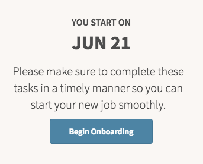

# HR Employee Next Task

## Description

Display a message and start the onboarding process with this HR Service Portal widget.

## Screenshot

## Additional Information/Notes

Uses ServiceNow® [Employee Service Center](https://docs.servicenow.com/bundle/kingston-hr-service-delivery/page/product/human-resources/concept/c_UseTheHRSMPortal.html) (HR Service Portal)

## Configuration

### Widget Option Schema

| Option | Description | Default Value |
| :--- | :--- | :--- |
| `First Day Guide link` | Sets the button URL. |  |
| `Maternity Guide link` | Sets the button URL. |  |
| `Need Extension Link` | Sets the button URL. |  |
| `Last Day Guide Link` | Sets the button URL. |  |

## Platform Dependencies

### SN System Tables

* sn_hr_core_profile
* sn_hr_core_case
* sn_hr_core_task

## Sample Data and Data Structures

> See 'Configuration' above

## CSS/SASS Variables

_CSS/SASS variables are given default values that can be overridden with theming or portal-level CSS._

> None

## Related Notes

- [[ServiceNowOfficialDocs/servicenow-dev-program/code-snippets/Modern Development/Service Portal Widgets/serviceportal-widget-library/serviceportal-widget-library-master/hr/pe-case-detail/README|pe-case-detail]]
- [[ServiceNowOfficialDocs/servicenow-dev-program/code-snippets/Modern Development/Service Portal Widgets/serviceportal-widget-library/serviceportal-widget-library-master/hr/pe-catalog-list/README|pe-catalog-list]]
- [[ServiceNowOfficialDocs/servicenow-dev-program/code-snippets/Modern Development/Service Portal Widgets/serviceportal-widget-library/serviceportal-widget-library-master/hr/pe-direct-deposit/README|pe-direct-deposit]]
- [[ServiceNowOfficialDocs/servicenow-dev-program/code-snippets/Modern Development/Service Portal Widgets/serviceportal-widget-library/serviceportal-widget-library-master/hr/pe-info/README|pe-info]]
- [[ServiceNowOfficialDocs/servicenow-dev-program/code-snippets/Modern Development/Service Portal Widgets/serviceportal-widget-library/serviceportal-widget-library-master/hr/pe-office-space/README|pe-office-space]]
- [[ServiceNowOfficialDocs/servicenow-dev-program/code-snippets/Modern Development/Service Portal Widgets/serviceportal-widget-library/serviceportal-widget-library-master/hr/pe-orientation/README|pe-orientation]]
