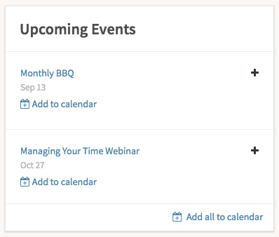
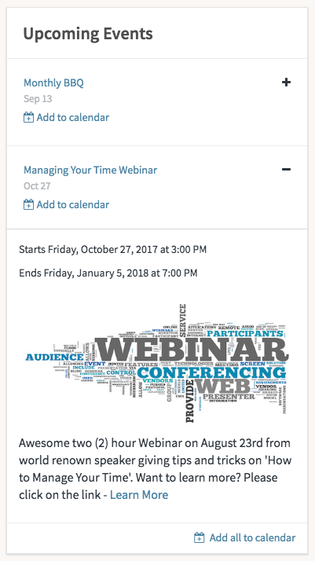

# HR Upcoming Events

## Description

View upcoming events from company management with this HR Service Portal widget.

## Screenshots

### Collapsed

### Expanded

## Additional Information/Notes

* Out-of-box (OOB) HR Widget
* Uses ServiceNow® [Employee Service Center](https://docs.servicenow.com/bundle/kingston-hr-service-delivery/page/product/human-resources/concept/c_UseTheHRSMPortal.html) (HR Service Portal)

## Configuration

### Widget Option Schema

| Option | Description | Default Value |
| :--- | :--- | :--- |
| `HR widget instance name` | Sets the widget instance. |  |

## Platform Dependencies

### SN System Tables

> None

## Sample Data and Data Structures

> See 'Configuration' above

## CSS/SASS Variables

_CSS/SASS variables are given default values that can be overridden with theming or portal-level CSS._

> None

## Related Notes

- [[ServiceNowOfficialDocs/servicenow-dev-program/code-snippets/Modern Development/Service Portal Widgets/serviceportal-widget-library/serviceportal-widget-library-master/hr/pe-case-detail/README|pe-case-detail]]
- [[ServiceNowOfficialDocs/servicenow-dev-program/code-snippets/Modern Development/Service Portal Widgets/serviceportal-widget-library/serviceportal-widget-library-master/hr/pe-catalog-list/README|pe-catalog-list]]
- [[ServiceNowOfficialDocs/servicenow-dev-program/code-snippets/Modern Development/Service Portal Widgets/serviceportal-widget-library/serviceportal-widget-library-master/hr/pe-direct-deposit/README|pe-direct-deposit]]
- [[ServiceNowOfficialDocs/servicenow-dev-program/code-snippets/Modern Development/Service Portal Widgets/serviceportal-widget-library/serviceportal-widget-library-master/hr/pe-info/README|pe-info]]
- [[ServiceNowOfficialDocs/servicenow-dev-program/code-snippets/Modern Development/Service Portal Widgets/serviceportal-widget-library/serviceportal-widget-library-master/hr/pe-next-task/README|pe-next-task]]
- [[ServiceNowOfficialDocs/servicenow-dev-program/code-snippets/Modern Development/Service Portal Widgets/serviceportal-widget-library/serviceportal-widget-library-master/hr/pe-office-space/README|pe-office-space]]
