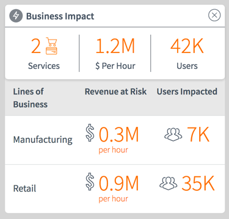

# Business Impact Details

## Description

Query the most recent anomaly alert from the *em_alert_anomaly* table to provide Business Services Impact Details.

## Screenshots


## Additional Information/Notes
This widget is included as part of the update set **[pe-business-impact.u-update-set.xml](https://github.com/platform-experience/serviceportal-widget-library/blob/master/pe-business-impact/pe-business-impact.u-update-set.xml)** <br/><br/>

---
## Installation
---
> See README for **[pe-business-impact](https://github.com/platform-experience/serviceportal-widget-library/blob/master/pe-business-impact/README.md)**
---
## Configuration
---
Widget Option Schema parameters:

**alert_sysid**: Provide an anomaly alert's sys_id and data in the widget will display based on related records.
**titleIconClasses**: Provide a set of Font Awesome css classes for an icon to display next to the title. Defaults to `'fa fa-bolt'`.

---
## Platform Dependencies
---
### SN Plugin Support
> See README for **[pe-business-impact](https://github.com/platform-experience/serviceportal-widget-library/blob/master/pe-business-impact/README.md)**
---
## CSS/SASS Variables
---
_CSS/SASS variables are given default values that can be overridden with theming or portal-level CSS._

```scss
$slate: #485563;
$orange: #ff6f00;
$medium-green: #34ba3d;
$icon-circle-color: #7e848b !default;
$text-color: $slate !default;
$divider-color: #7E848B !default;
$status-alert-color: $orange !default;
$status-recovered-color: $medium-green !default;
```

## Related Notes

- [[ServiceNowOfficialDocs/servicenow-dev-program/code-snippets/Modern Development/Service Portal Widgets/serviceportal-widget-library/serviceportal-widget-library-master/README|serviceportal-widget-library-master]]
- [[ServiceNowOfficialDocs/servicenow-dev-program/code-snippets/Modern Development/Service Portal Widgets/serviceportal-widget-library/serviceportal-widget-library-master/docs/CONTRIBUTING|Widget Contribution]]
- [[ServiceNowOfficialDocs/servicenow-dev-program/code-snippets/Modern Development/Service Portal Widgets/serviceportal-widget-library/serviceportal-widget-library-master/docs/help|help]]
- [[ServiceNowOfficialDocs/servicenow-dev-program/code-snippets/Modern Development/Service Portal Widgets/serviceportal-widget-library/serviceportal-widget-library-master/pe-app-analytics/README|pe-app-analytics]]
- [[ServiceNowOfficialDocs/servicenow-dev-program/code-snippets/Modern Development/Service Portal Widgets/serviceportal-widget-library/serviceportal-widget-library-master/pe-appointment-list/README|pe-appointment-list]]
- [[ServiceNowOfficialDocs/servicenow-dev-program/code-snippets/Modern Development/Service Portal Widgets/serviceportal-widget-library/serviceportal-widget-library-master/pe-appointment-scheduler/README|pe-appointment-scheduler]]
