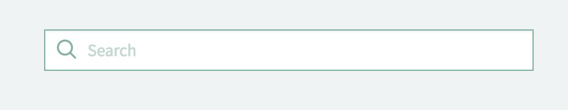
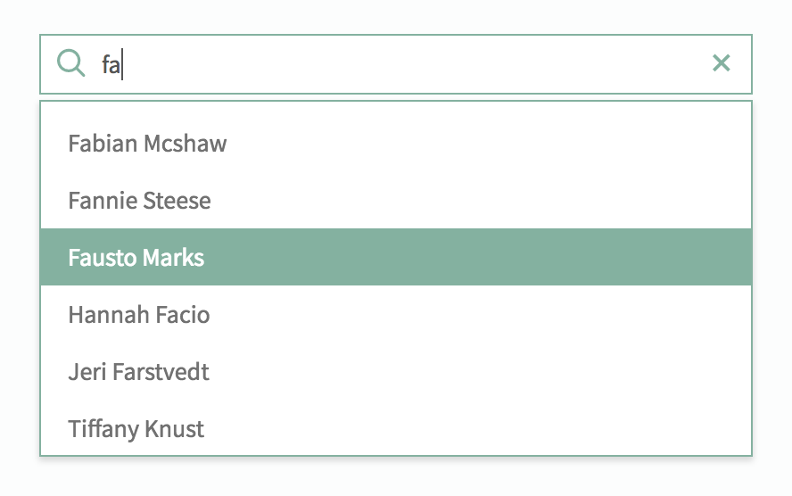

# Typeahead Search

## Description

Typeahead Search lets the user searching with suggestions, through REST, and finally to select and send a record through the event "pe-typeahead-selection".

## Screenshots

## Additional Information/Notes
> None
---
## Installation
---
Download and install update set **[pe-rest-typeahead-search.u-update-set.xml](https://github.com/platform-experience/serviceportal-widget-library/blob/master/pe-rest-typeahead-search/pe-rest-typeahead-search.u-update-set.xml)**   
After installation, the widget can be accessed via the `Service Portal > Widgets` section for use and customization. 
* SN Product Documentation - ['Update set use'](https://docs.servicenow.com/bundle/london-application-development/page/build/system-update-sets/concept/update-set-procedures.html)

---
## Configuration
---
Widget Option Schema parameters:
> Table name
> Query Field/Column
> Display Field/Column
> Sorting
> Bootstrap configuration (colors and wrapper/padding)

---
## Platform Dependencies
---

---
## Sample Data and Data Structures
---
Sample data is in the default options.

---
## API Dependencies
---
<i>Dependencies are included and configured as part of the provided Update Set.</i>
> typeahead.js v1.2.0
---
## CSS/SASS Variables
---
_CSS/SASS variables are given default values that can be overridden with theming or portal-level CSS._
> $pe-rest-typeahead-hover-color
> $pe-rest-typeahead-hover-bg
> $pe-rest-typeahead-menu-bg
> $pe-rest-typeahead-border-color
> $pe-rest-typeahead-border-radius
> $pe-rest-typeahead-border
> $pe-rest-typeahead-max-width
> $pe-rest-typeahead-dim-opacity

## Related Notes

- [[ServiceNowOfficialDocs/servicenow-dev-program/code-snippets/Modern Development/Service Portal Widgets/serviceportal-widget-library/serviceportal-widget-library-master/README|serviceportal-widget-library-master]]
- [[ServiceNowOfficialDocs/servicenow-dev-program/code-snippets/Modern Development/Service Portal Widgets/serviceportal-widget-library/serviceportal-widget-library-master/docs/CONTRIBUTING|Widget Contribution]]
- [[ServiceNowOfficialDocs/servicenow-dev-program/code-snippets/Modern Development/Service Portal Widgets/serviceportal-widget-library/serviceportal-widget-library-master/docs/help|help]]
- [[ServiceNowOfficialDocs/servicenow-dev-program/code-snippets/Modern Development/Service Portal Widgets/serviceportal-widget-library/serviceportal-widget-library-master/pe-app-analytics/README|pe-app-analytics]]
- [[ServiceNowOfficialDocs/servicenow-dev-program/code-snippets/Modern Development/Service Portal Widgets/serviceportal-widget-library/serviceportal-widget-library-master/pe-appointment-list/README|pe-appointment-list]]
- [[ServiceNowOfficialDocs/servicenow-dev-program/code-snippets/Modern Development/Service Portal Widgets/serviceportal-widget-library/serviceportal-widget-library-master/pe-appointment-scheduler/README|pe-appointment-scheduler]]
