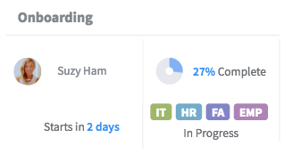

# Status Card Snippet

## Description

This snippet can be used to have a valid starting point for displaying a status card.

## Screenshots

## Additional Information/Notes

This widget makes use of the following additional widgets:
* [pe-donut-chart widget](https://github.com/platform-experience/serviceportal-widget-library/tree/master/pe-donut-chart) to display a donut chart representing the progress status.

* [pe-people-info widget](https://github.com/platform-experience/serviceportal-widget-library/tree/master/People%20Card/pe-people-info) to display user avatar, name and title.

> Widget(s) are included with the update set.

Donut Chart and People Info widget are injected dynamically in client controller.

---
## Installation
---
Download and install update set **[pe-status-card-snippet.u-update-set.xml](https://github.com/platform-experience/serviceportal-widget-library/blob/master/pe-status-card-snippet/pe-status-card-snippet.u-update-set.xml)**   
After installation, the widget can be accessed via the `Service Portal > Widgets` section for use and customization. 
* SN Product Documentation - ['Load a customization from a single XML file'](https://docs.servicenow.com/bundle/kingston-application-development/page/build/system-update-sets/task/t_SaveAnUpdateSetAsAnXMLFile.html)

---
## Configuration
---
Widget Option Schema parameters:

**Title**

---
## Platform Dependencies
---
> None
---
## Sample Data and Data Structures
---
Sample data is provided as JSON objects in the Server Script.

---
## API Dependencies
---
<i>Dependencies are included and configured as part of the provided Update Set.</i>
> None
---
## CSS/SASS Variables
---
_CSS/SASS variables are given default values that can be overridden with theming or portal-level CSS._
> None

## Related Notes

- [[ServiceNowOfficialDocs/servicenow-dev-program/code-snippets/Modern Development/Service Portal Widgets/serviceportal-widget-library/serviceportal-widget-library-master/README|serviceportal-widget-library-master]]
- [[ServiceNowOfficialDocs/servicenow-dev-program/code-snippets/Modern Development/Service Portal Widgets/serviceportal-widget-library/serviceportal-widget-library-master/docs/CONTRIBUTING|Widget Contribution]]
- [[ServiceNowOfficialDocs/servicenow-dev-program/code-snippets/Modern Development/Service Portal Widgets/serviceportal-widget-library/serviceportal-widget-library-master/docs/help|help]]
- [[ServiceNowOfficialDocs/servicenow-dev-program/code-snippets/Modern Development/Service Portal Widgets/serviceportal-widget-library/serviceportal-widget-library-master/pe-app-analytics/README|pe-app-analytics]]
- [[ServiceNowOfficialDocs/servicenow-dev-program/code-snippets/Modern Development/Service Portal Widgets/serviceportal-widget-library/serviceportal-widget-library-master/pe-appointment-list/README|pe-appointment-list]]
- [[ServiceNowOfficialDocs/servicenow-dev-program/code-snippets/Modern Development/Service Portal Widgets/serviceportal-widget-library/serviceportal-widget-library-master/pe-appointment-scheduler/README|pe-appointment-scheduler]]
