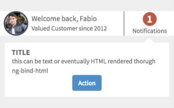

# Welcome User

## Description

This widget can be used to create a simple people card with name and profile picture when the user login, and provide notifications basing on custom events.

## Screenshots


## Additional Information/Notes
> None
---
## Installation
Download and install update set **[pe-welcome-user.u-update-set.xml](https://github.com/platform-experience/serviceportal-widget-library/blob/master/people-card/pe-welcome-user/pe-welcome-user.u-update-set.xml)** <br/><br/>
After installation, the widget can be accessed via the `Service Portal > Widgets` section for use and customization.<br/>
* SN Product Documentation - ['Load a customization from a single XML file'](https://docs.servicenow.com/bundle/kingston-application-development/page/build/system-update-sets/task/t_SaveAnUpdateSetAsAnXMLFile.html)

---
## Configuration
Language variants can be created through the section System UI -> UI Messages and displayed adding in the HTML body a statement with the syntax:

```html
${<i>key value specified in the Message record</i>}
```
---
## Platform Dependencies
> None
---
## Sample Data and Data Structures
> See 'Configuration' above
---
## API Dependencies
<i>Dependencies are included and configured as part of the provided Update Set.</i>
> None
---
## CSS/SASS Variables
The widget is using colors from Bootstrap SASS variables, and a minimal style configuration to make it easy to customize.
_CSS/SASS variables are given default values that can be overridden with theming or portal-level CSS._

## Related Notes

- [[ServiceNowOfficialDocs/servicenow-dev-program/code-snippets/Modern Development/Service Portal Widgets/serviceportal-widget-library/serviceportal-widget-library-master/people-card/pe-people-info/Readme|pe-people-info]]
- [[ServiceNowOfficialDocs/servicenow-dev-program/code-snippets/Modern Development/Service Portal Widgets/serviceportal-widget-library/serviceportal-widget-library-master/people-card/pe-technician-card/README|pe-technician-card]]
