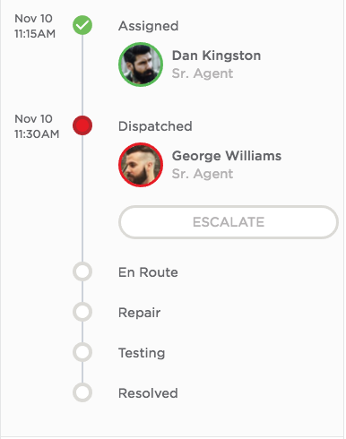

# Timeline - Variant Used In CSM Experience

## Description

This widget can be used to create a timeline with user avatar, name, title, etc.

## Screenshot

## Additional Information/Notes
This widget makes use of [pe-people-info](https://github.com/platform-experience/serviceportal-widget-library/tree/master/people-card/pe-people-info) widget to display user avatar, name and title, this widget is already part of the update set.

---
## Installation
Download and install update set **[pe-csm-timeline.u-update-set.xml](https://github.com/platform-experience/serviceportal-widget-library/blob/master/timeline/pe-csm-timeline/pe-csm-timeline.u-update-set.xml)**   
After installation, the widget can be accessed via the `Service Portal > Widgets` section for use and customization. 
* SN Product Documentation - ['Load a customization from a single XML file'](https://docs.servicenow.com/bundle/kingston-application-development/page/build/system-update-sets/task/t_SaveAnUpdateSetAsAnXMLFile.html)

---
## Configuration

### Widget Option Schema

| Option | Description | Default Value |
| :--- | :--- | :--- |
| `User SysID` | Set SysID | 9ec35b8713453a007e94fc5ed144b09a |
| `Show Only Picture` | Display picture only | false |
| `Show Job Title` | Display the job title | true |
| `Show Call and Chat` | Show the call and chat | false |

---
## Platform Dependencies
> None
---
## Sample Data and Data Structures
> None
---
## API Dependencies
<i>Dependencies are included and configured as part of the provided Update Set.</i>
> None
---
## CSS/SASS Variables
_CSS/SASS variables are given default values that can be overridden with theming or portal-level CSS._
> None

## Related Notes

- [[ServiceNowOfficialDocs/servicenow-dev-program/code-snippets/Modern Development/Service Portal Widgets/serviceportal-widget-library/serviceportal-widget-library-master/timeline/pe-animated-timeline/README|pe-animated-timeline]]
- [[ServiceNowOfficialDocs/servicenow-dev-program/code-snippets/Modern Development/Service Portal Widgets/serviceportal-widget-library/serviceportal-widget-library-master/timeline/pe-incident-timeline/README|pe-incident-timeline]]
- [[ServiceNowOfficialDocs/servicenow-dev-program/code-snippets/Modern Development/Service Portal Widgets/serviceportal-widget-library/serviceportal-widget-library-master/timeline/pe-timeline-delivery-info/README|pe-timeline-delivery-info]]
- [[ServiceNowOfficialDocs/servicenow-dev-program/code-snippets/Modern Development/Service Portal Widgets/serviceportal-widget-library/serviceportal-widget-library-master/timeline/pe-timeline-emp-exp/Readme|pe-timeline-emp-exp]]
- [[ServiceNowOfficialDocs/servicenow-dev-program/code-snippets/Modern Development/Service Portal Widgets/serviceportal-widget-library/serviceportal-widget-library-master/timeline/pe-timeline/Readme|pe-timeline]]
