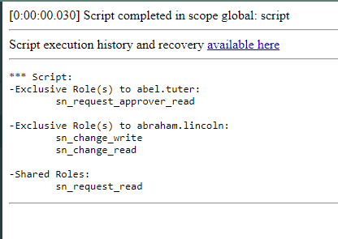

# Compare Roles of Two Users

Provide the usernames of two users and this script will print out the roles they share and the roles they don't share.

> ⚠️ **Note:** ServiceNow provides out-of-the-box functionality for comparing user access via the **Access Analyzer** . You can learn more here: https://www.servicenow.com/docs/bundle/zurich-platform-security/page/integrate/identity/task/comparing-access-controlss**
>
**Parameters:** 
- **includeInheritedRoles:**
  - `false` – only directly assigned roles  
  - `true` – include roles inherited from other roles or groups

- **usernameA**  
  - Username of a `sys_user`

- **usernameB**  
  - Username of a `sys_user`

The script will output:
- Roles exclusive to user A
- Roles exclusive to user B
- Shared roles

## Example Result

## Related Notes

- [[ServiceNowOfficialDocs/servicenow-dev-program/code-snippets/Server-Side Components/Background Scripts/ACL Audit Utility/README|ACL Audit Utility]]
- [[ServiceNowOfficialDocs/servicenow-dev-program/code-snippets/Server-Side Components/Background Scripts/Access Analysis Utility/README|Access Analysis Utility]]
- [[ServiceNowOfficialDocs/servicenow-dev-program/code-snippets/Server-Side Components/Background Scripts/Add Bookmarks - ITIL Users/README|Add Bookmarks - ITIL Users]]
- [[ServiceNowOfficialDocs/servicenow-dev-program/code-snippets/Server-Side Components/Background Scripts/Add Comments/README|Add Comments]]
- [[ServiceNowOfficialDocs/servicenow-dev-program/code-snippets/Server-Side Components/Background Scripts/Add No Audit Attribute To Multiple Dictionary Entries/README|Add No Audit Attribute To Multiple Dictionary Entries]]
- [[ServiceNowOfficialDocs/servicenow-dev-program/code-snippets/Server-Side Components/Background Scripts/Add Standard Change Model/README|Add Standard Change Model]]
