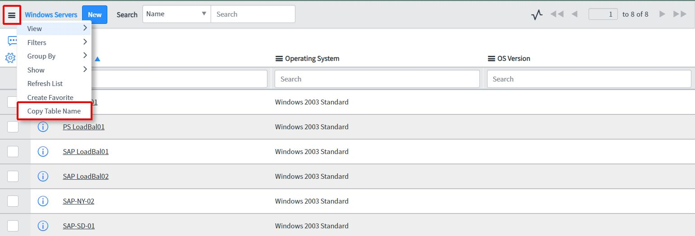

# Add "Copy Table Name" menu item to the List context
* **Description:** This background script programmatically adds a menu item to any list context menu that will copy the respective table name of that list.

    >
**Example:** In this case, clicking the "Copy Table Name" menu item will copy ```cmdb_ci_win_server``` to your clipboard
* **Usage:** 
    - **addMenuItem.js:** Run this background script to add the menu item to the list context menu.
    - **removeMenuItem.js:** Run this background script to remove a previously added menu item.

## Related Notes

- [[ServiceNowOfficialDocs/servicenow-dev-program/code-snippets/Server-Side Components/Background Scripts/ACL Audit Utility/README|ACL Audit Utility]]
- [[ServiceNowOfficialDocs/servicenow-dev-program/code-snippets/Server-Side Components/Background Scripts/Access Analysis Utility/README|Access Analysis Utility]]
- [[ServiceNowOfficialDocs/servicenow-dev-program/code-snippets/Server-Side Components/Background Scripts/Add Bookmarks - ITIL Users/README|Add Bookmarks - ITIL Users]]
- [[ServiceNowOfficialDocs/servicenow-dev-program/code-snippets/Server-Side Components/Background Scripts/Add Comments/README|Add Comments]]
- [[ServiceNowOfficialDocs/servicenow-dev-program/code-snippets/Server-Side Components/Background Scripts/Add No Audit Attribute To Multiple Dictionary Entries/README|Add No Audit Attribute To Multiple Dictionary Entries]]
- [[ServiceNowOfficialDocs/servicenow-dev-program/code-snippets/Server-Side Components/Background Scripts/Add Standard Change Model/README|Add Standard Change Model]]
