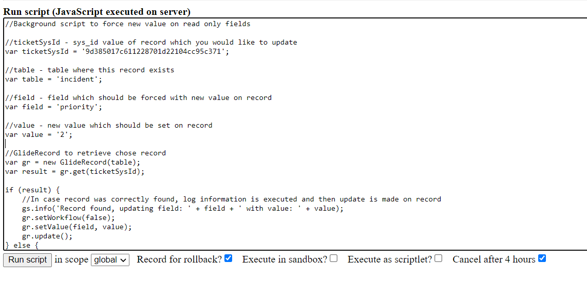
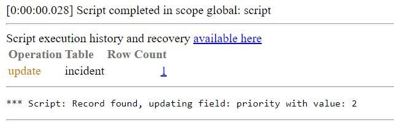

**Background Script**

Background Script, to force update on read only or protected fields. It can be used when it is a need of fixing a value, of field which can not be done from list / form edit. It can be used to any type of table, record and field, need just correct configuration.

**How to use**

You need to fill all four variables which are placed on the begging of the script with values:

- ticketSysId - sys_id value of record which you would like to update
- table - table where this record exists
- field - field which should be forced with new value on record
- value - new value which should be set on record

**Example execution**

Values choosed in this example: 

Execution log:

Execution effect on incident record

## Related Notes

- [[ServiceNowOfficialDocs/servicenow-dev-program/code-snippets/Server-Side Components/Background Scripts/ACL Audit Utility/README|ACL Audit Utility]]
- [[ServiceNowOfficialDocs/servicenow-dev-program/code-snippets/Server-Side Components/Background Scripts/Access Analysis Utility/README|Access Analysis Utility]]
- [[ServiceNowOfficialDocs/servicenow-dev-program/code-snippets/Server-Side Components/Background Scripts/Add Bookmarks - ITIL Users/README|Add Bookmarks - ITIL Users]]
- [[ServiceNowOfficialDocs/servicenow-dev-program/code-snippets/Server-Side Components/Background Scripts/Add Comments/README|Add Comments]]
- [[ServiceNowOfficialDocs/servicenow-dev-program/code-snippets/Server-Side Components/Background Scripts/Add No Audit Attribute To Multiple Dictionary Entries/README|Add No Audit Attribute To Multiple Dictionary Entries]]
- [[ServiceNowOfficialDocs/servicenow-dev-program/code-snippets/Server-Side Components/Background Scripts/Add Standard Change Model/README|Add Standard Change Model]]
