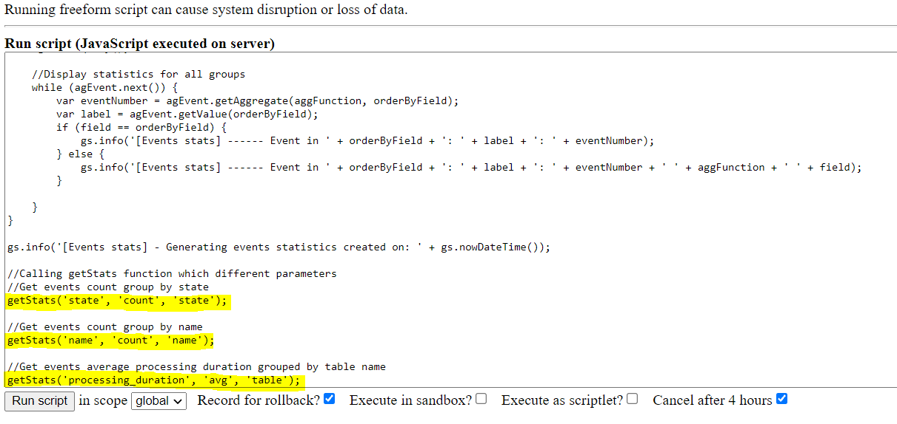
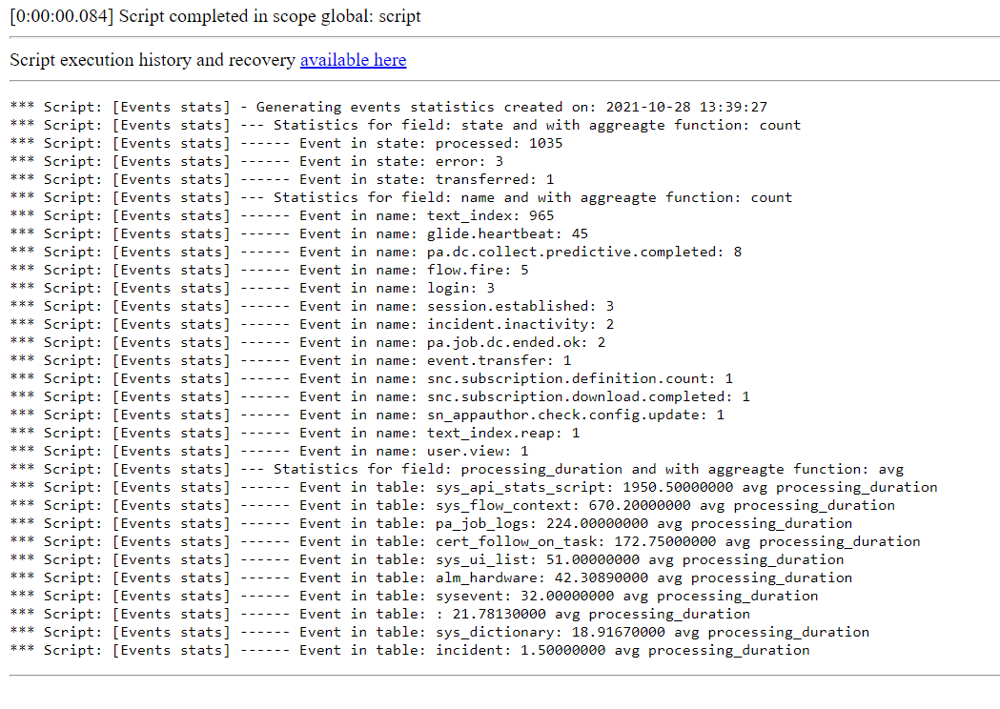

**Background Script** 

Background Script, to easily generate statistics about today's created events in system. You can call getStats() with different parameters to get information about current situation in sysevent table. You can generate statistic about different aggregation functions, different aggregation fields and selected group by fields. It can be helpful for example to detect which type of events have the longest average processing duration or which type of events was created the most today.

**How to use** 

You need to call getStats() function with three parameters:

- field - name of field which should be used in aggregate function
- aggFunction - name of aggregate function which should be used
- orderByField - name of field which should be used to orderBy

**Example execution**

Values choosed in this example:

 
 
Execution log:

 

## Related Notes

- [[ServiceNowOfficialDocs/servicenow-dev-program/code-snippets/Server-Side Components/Background Scripts/ACL Audit Utility/README|ACL Audit Utility]]
- [[ServiceNowOfficialDocs/servicenow-dev-program/code-snippets/Server-Side Components/Background Scripts/Access Analysis Utility/README|Access Analysis Utility]]
- [[ServiceNowOfficialDocs/servicenow-dev-program/code-snippets/Server-Side Components/Background Scripts/Add Bookmarks - ITIL Users/README|Add Bookmarks - ITIL Users]]
- [[ServiceNowOfficialDocs/servicenow-dev-program/code-snippets/Server-Side Components/Background Scripts/Add Comments/README|Add Comments]]
- [[ServiceNowOfficialDocs/servicenow-dev-program/code-snippets/Server-Side Components/Background Scripts/Add No Audit Attribute To Multiple Dictionary Entries/README|Add No Audit Attribute To Multiple Dictionary Entries]]
- [[ServiceNowOfficialDocs/servicenow-dev-program/code-snippets/Server-Side Components/Background Scripts/Add Standard Change Model/README|Add Standard Change Model]]
