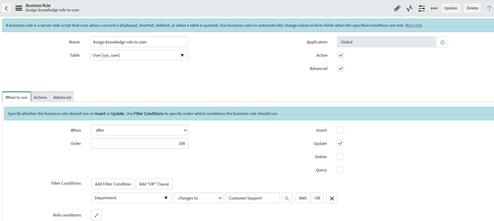
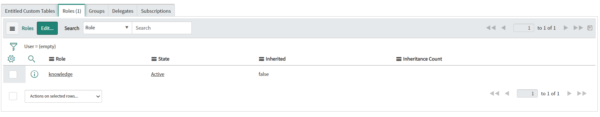

**Business Rule**

Script to *automatically assign* a *specific role* on creation or update of users, with additional protection against duplication of roles. You can run that Business Rules based on your needs (on user creation or on update when specific field was changed). To assign different role, copy sys_id of chose role into ROLE_ID variable.

**Example configuration of Business Rule**

**Example execution effect**

## Related Notes

- [[ServiceNowOfficialDocs/servicenow-dev-program/code-snippets/Server-Side Components/Business Rules/ATF Duplicate Execution Order/README|ATF Duplicate Execution Order]]
- [[ServiceNowOfficialDocs/servicenow-dev-program/code-snippets/Server-Side Components/Business Rules/Abort Parent Incident Closure When Child is Open/README|Abort Parent Incident Closure When Child is Open]]
- [[ServiceNowOfficialDocs/servicenow-dev-program/code-snippets/Server-Side Components/Business Rules/Add HR task for HR case/README|Add HR task for HR case]]
- [[ServiceNowOfficialDocs/servicenow-dev-program/code-snippets/Server-Side Components/Business Rules/Add itil role to ootb user query to also see inactive users/README|Add itil role to ootb user query to also see inactive users]]
- [[ServiceNowOfficialDocs/servicenow-dev-program/code-snippets/Server-Side Components/Business Rules/Add notes on tag addition or removal/README|Add notes on tag addition or removal]]
- [[ServiceNowOfficialDocs/servicenow-dev-program/code-snippets/Server-Side Components/Business Rules/Add or remove a tag from the ticket whenever the comments are updated/README|Add or remove a tag from the ticket whenever the comments are updated]]
