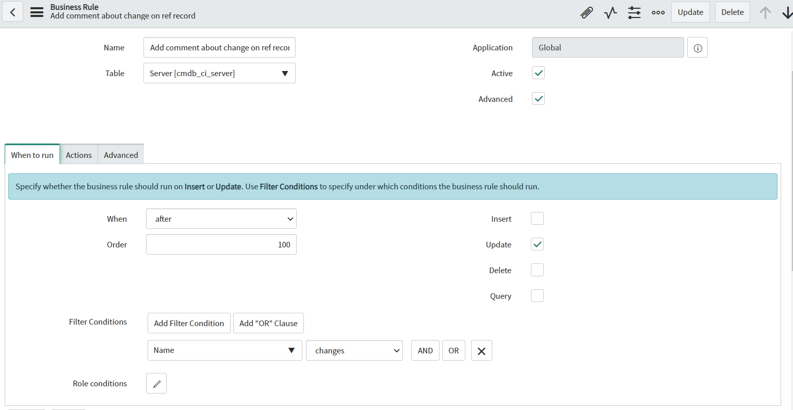
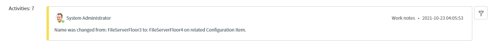

**Business Rule**

 Script which allows adding comments to referenced records after some insert or update was made. In this example, after changing name on a Configuration Item, all incident which have that Ci  assigned will get comment about that change. You can change the script to different table, query and conditions to fit your needs.

 **Example configuration of  Business Rule** 

**Example effect of execution**

## Related Notes

- [[ServiceNowOfficialDocs/servicenow-dev-program/code-snippets/Server-Side Components/Business Rules/ATF Duplicate Execution Order/README|ATF Duplicate Execution Order]]
- [[ServiceNowOfficialDocs/servicenow-dev-program/code-snippets/Server-Side Components/Business Rules/Abort Parent Incident Closure When Child is Open/README|Abort Parent Incident Closure When Child is Open]]
- [[ServiceNowOfficialDocs/servicenow-dev-program/code-snippets/Server-Side Components/Business Rules/Add HR task for HR case/README|Add HR task for HR case]]
- [[ServiceNowOfficialDocs/servicenow-dev-program/code-snippets/Server-Side Components/Business Rules/Add itil role to ootb user query to also see inactive users/README|Add itil role to ootb user query to also see inactive users]]
- [[ServiceNowOfficialDocs/servicenow-dev-program/code-snippets/Server-Side Components/Business Rules/Add notes on tag addition or removal/README|Add notes on tag addition or removal]]
- [[ServiceNowOfficialDocs/servicenow-dev-program/code-snippets/Server-Side Components/Business Rules/Add or remove a tag from the ticket whenever the comments are updated/README|Add or remove a tag from the ticket whenever the comments are updated]]
