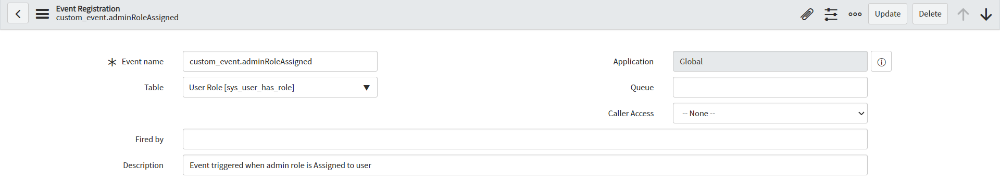
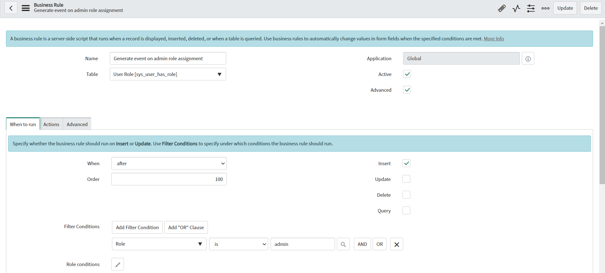
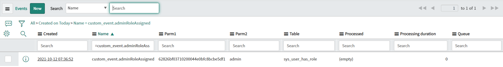

**Business Rule**

Script to *generate new custom event*, which can be used on any conditions, on insert/update/delete of a record. In this example Business Rule is configured to generate custom event when any user get 'admin' role. 

**Event Registration**

Before you can generate custom event from script, you need to add Event Registration record *(sysevent_register table)*. Example Event Registration configuration:

**Example configuration of Business Rule**

**Example execution effect**

## Related Notes

- [[ServiceNowOfficialDocs/servicenow-dev-program/code-snippets/Server-Side Components/Business Rules/ATF Duplicate Execution Order/README|ATF Duplicate Execution Order]]
- [[ServiceNowOfficialDocs/servicenow-dev-program/code-snippets/Server-Side Components/Business Rules/Abort Parent Incident Closure When Child is Open/README|Abort Parent Incident Closure When Child is Open]]
- [[ServiceNowOfficialDocs/servicenow-dev-program/code-snippets/Server-Side Components/Business Rules/Add HR task for HR case/README|Add HR task for HR case]]
- [[ServiceNowOfficialDocs/servicenow-dev-program/code-snippets/Server-Side Components/Business Rules/Add itil role to ootb user query to also see inactive users/README|Add itil role to ootb user query to also see inactive users]]
- [[ServiceNowOfficialDocs/servicenow-dev-program/code-snippets/Server-Side Components/Business Rules/Add notes on tag addition or removal/README|Add notes on tag addition or removal]]
- [[ServiceNowOfficialDocs/servicenow-dev-program/code-snippets/Server-Side Components/Business Rules/Add or remove a tag from the ticket whenever the comments are updated/README|Add or remove a tag from the ticket whenever the comments are updated]]
