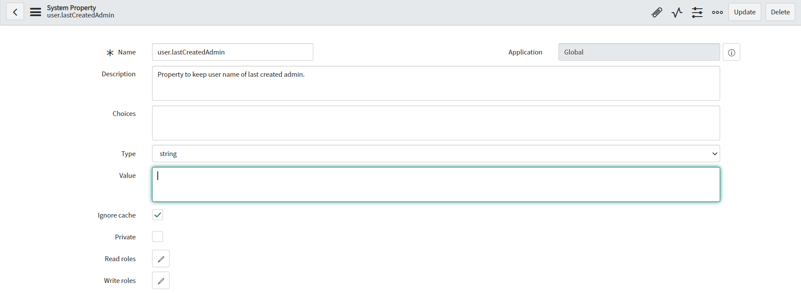
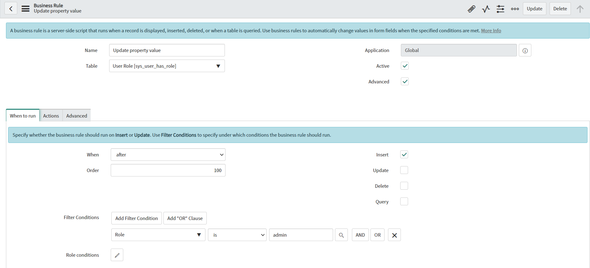
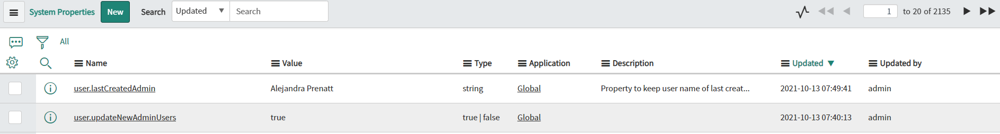

**Business Rule**

Script which allows *getting value of specific system property and manipulate these values*. In this example, true/false property is got to determine if script should be executed. Then value of system property which is keeping last created user which gets 'admin' role is updated.

**Create new system property**

Before you can get or manipulate custom system property you need to create it in [sys_properties] table. Below you can see example of created property:

**Example configuration of Business Rule**

**Example execution effect**

## Related Notes

- [[ServiceNowOfficialDocs/servicenow-dev-program/code-snippets/Server-Side Components/Business Rules/ATF Duplicate Execution Order/README|ATF Duplicate Execution Order]]
- [[ServiceNowOfficialDocs/servicenow-dev-program/code-snippets/Server-Side Components/Business Rules/Abort Parent Incident Closure When Child is Open/README|Abort Parent Incident Closure When Child is Open]]
- [[ServiceNowOfficialDocs/servicenow-dev-program/code-snippets/Server-Side Components/Business Rules/Add HR task for HR case/README|Add HR task for HR case]]
- [[ServiceNowOfficialDocs/servicenow-dev-program/code-snippets/Server-Side Components/Business Rules/Add itil role to ootb user query to also see inactive users/README|Add itil role to ootb user query to also see inactive users]]
- [[ServiceNowOfficialDocs/servicenow-dev-program/code-snippets/Server-Side Components/Business Rules/Add notes on tag addition or removal/README|Add notes on tag addition or removal]]
- [[ServiceNowOfficialDocs/servicenow-dev-program/code-snippets/Server-Side Components/Business Rules/Add or remove a tag from the ticket whenever the comments are updated/README|Add or remove a tag from the ticket whenever the comments are updated]]
