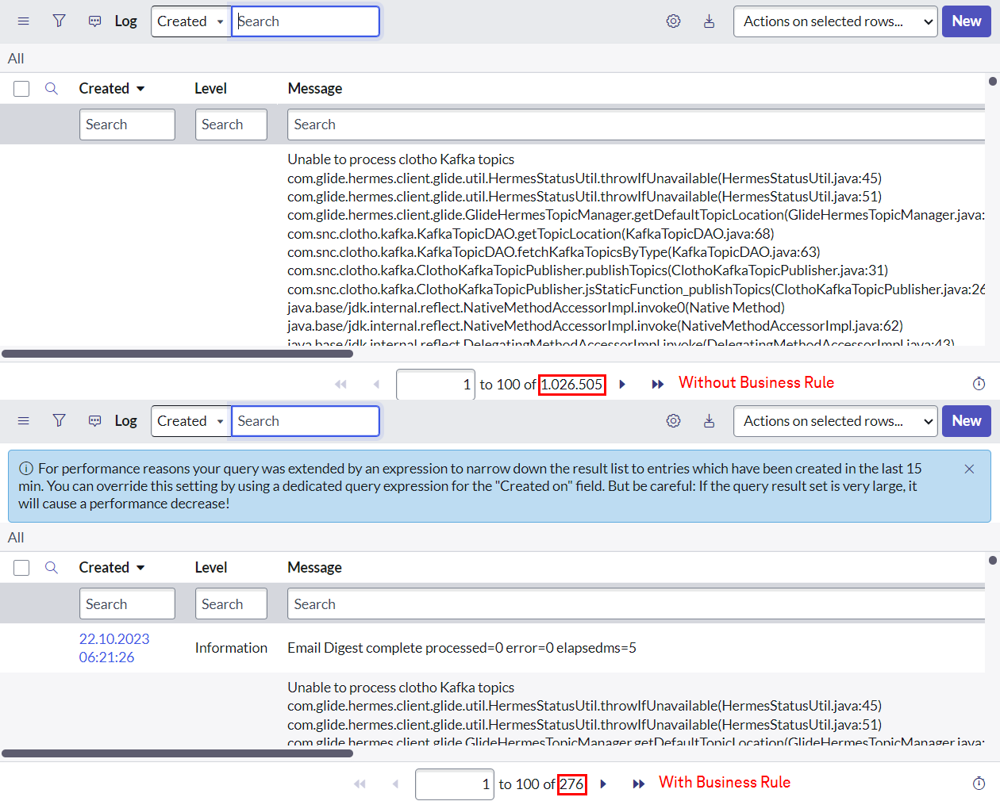

# Description

Unexperienced users open large tables like `syslog`, `sysevent` or any CMDB table with several millions of records just by entering TABLENAME.list into the application navigator - wondering why it takes minutes to load the results.

The reason: Without any reduction to a time window a so-called "full table scan" is performed behin the scenes to determine the the number of records in that table. 

To protect the user from having their session locked for several minutes, my business rule adds a portion to the query that restricts search results to records created in the last 15 minutes.

If the user already added any condition for the `sys_created_on` field then no query changes are done.

# Business Rule

**Table:** `syslog`

**When:** Query

**Condition:** `gs.getSession().isInteractive()`

# Result

## Related Notes

- [[ServiceNowOfficialDocs/servicenow-dev-program/code-snippets/Server-Side Components/Business Rules/ATF Duplicate Execution Order/README|ATF Duplicate Execution Order]]
- [[ServiceNowOfficialDocs/servicenow-dev-program/code-snippets/Server-Side Components/Business Rules/Abort Parent Incident Closure When Child is Open/README|Abort Parent Incident Closure When Child is Open]]
- [[ServiceNowOfficialDocs/servicenow-dev-program/code-snippets/Server-Side Components/Business Rules/Add HR task for HR case/README|Add HR task for HR case]]
- [[ServiceNowOfficialDocs/servicenow-dev-program/code-snippets/Server-Side Components/Business Rules/Add itil role to ootb user query to also see inactive users/README|Add itil role to ootb user query to also see inactive users]]
- [[ServiceNowOfficialDocs/servicenow-dev-program/code-snippets/Server-Side Components/Business Rules/Add notes on tag addition or removal/README|Add notes on tag addition or removal]]
- [[ServiceNowOfficialDocs/servicenow-dev-program/code-snippets/Server-Side Components/Business Rules/Add or remove a tag from the ticket whenever the comments are updated/README|Add or remove a tag from the ticket whenever the comments are updated]]
