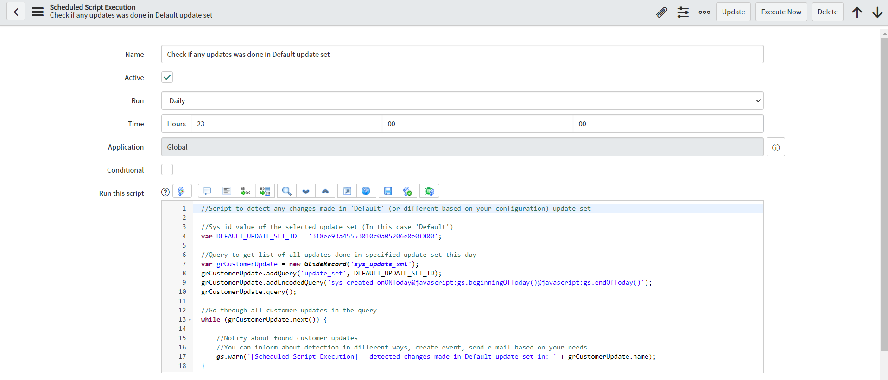
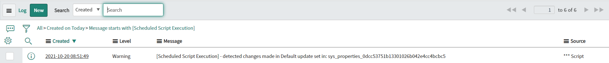

**Scheduled Script Execution**

This script allows detecting any customer updates made in 'Default' update set (on different one based on configuration) in this day. You can change the action after detection from logging, to sending e-mail notification or creating event based on your needs.

**Example configuration of Scheduled Script Execution**

 

**Example execution log**

 

## Related Notes

- [[ServiceNowOfficialDocs/servicenow-dev-program/code-snippets/Server-Side Components/Scheduled Jobs/API Token Expiry Warning/Readme|API Token Expiry Warning]]
- [[ServiceNowOfficialDocs/servicenow-dev-program/code-snippets/Server-Side Components/Scheduled Jobs/Approval Reminder/README|Approval Reminder]]
- [[ServiceNowOfficialDocs/servicenow-dev-program/code-snippets/Server-Side Components/Scheduled Jobs/Auto Disable account/Readme|Auto Disable account]]
- [[ServiceNowOfficialDocs/servicenow-dev-program/code-snippets/Server-Side Components/Scheduled Jobs/Auto close changes requests updated 30 days prior/README|Auto close changes requests updated 30 days prior]]
- [[ServiceNowOfficialDocs/servicenow-dev-program/code-snippets/Server-Side Components/Scheduled Jobs/Auto upgrade store applications/Readme|Auto upgrade store applications]]
- [[ServiceNowOfficialDocs/servicenow-dev-program/code-snippets/Server-Side Components/Scheduled Jobs/Auto-Assign Unassigned Incidents Older Than 30 Minutes/Readme|Auto-Assign Unassigned Incidents Older Than 30 Minutes]]
