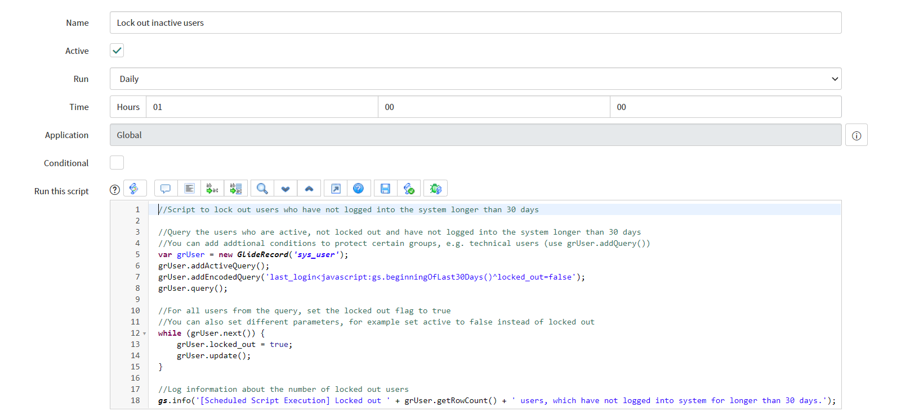

**Scheduled Script Execution**

This script allows to *lock out* users who have not logged into the system for *longer than 30 days*. You can customize the additional query parameters and change the current ones for example in order to shorten or enlarge the time period. 

**Example configuration of Scheduled Script Execution**
 

**Example execution log**
 

## Related Notes

- [[ServiceNowOfficialDocs/servicenow-dev-program/code-snippets/Server-Side Components/Scheduled Jobs/API Token Expiry Warning/Readme|API Token Expiry Warning]]
- [[ServiceNowOfficialDocs/servicenow-dev-program/code-snippets/Server-Side Components/Scheduled Jobs/Approval Reminder/README|Approval Reminder]]
- [[ServiceNowOfficialDocs/servicenow-dev-program/code-snippets/Server-Side Components/Scheduled Jobs/Auto Disable account/Readme|Auto Disable account]]
- [[ServiceNowOfficialDocs/servicenow-dev-program/code-snippets/Server-Side Components/Scheduled Jobs/Auto close changes requests updated 30 days prior/README|Auto close changes requests updated 30 days prior]]
- [[ServiceNowOfficialDocs/servicenow-dev-program/code-snippets/Server-Side Components/Scheduled Jobs/Auto upgrade store applications/Readme|Auto upgrade store applications]]
- [[ServiceNowOfficialDocs/servicenow-dev-program/code-snippets/Server-Side Components/Scheduled Jobs/Auto-Assign Unassigned Incidents Older Than 30 Minutes/Readme|Auto-Assign Unassigned Incidents Older Than 30 Minutes]]
