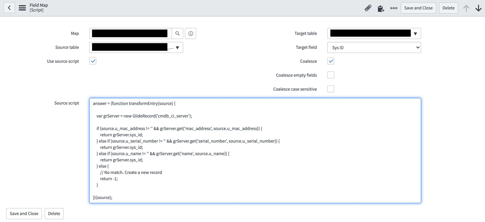

**Conditional Coalesce on Trasnform Maps**

When you have more than one field you want to coalesce based on some conditions, you can create a field mapping where source is a script and target field is SYS_ID.
You can put your conditional logic in the source script to do a conditional coalesce. Return the sys_id of the matched record for the transform to update it. Return -1 when there is not a match and you want to create a new record.

**Example configuration**

## Related Notes

- [[ServiceNowOfficialDocs/servicenow-dev-program/code-snippets/Server-Side Components/Transform Map Scripts/Check if the Import file is valid/README|Check if the Import file is valid]]
- [[ServiceNowOfficialDocs/servicenow-dev-program/code-snippets/Server-Side Components/Transform Map Scripts/Choice Field Validator/README|Choice Field Validator]]
- [[ServiceNowOfficialDocs/servicenow-dev-program/code-snippets/Server-Side Components/Transform Map Scripts/Email Formatter/README|Email Formatter]]
- [[ServiceNowOfficialDocs/servicenow-dev-program/code-snippets/Server-Side Components/Transform Map Scripts/Global Variable in Transform Map/README|Global Variable in Transform Map]]
- [[ServiceNowOfficialDocs/servicenow-dev-program/code-snippets/Server-Side Components/Transform Map Scripts/Incident Priority Set on Insert Only/README|Incident Priority Set on Insert Only]]
- [[ServiceNowOfficialDocs/servicenow-dev-program/code-snippets/Server-Side Components/Transform Map Scripts/Verify headers of a CSV attached file/README|Verify headers of a CSV attached file]]
