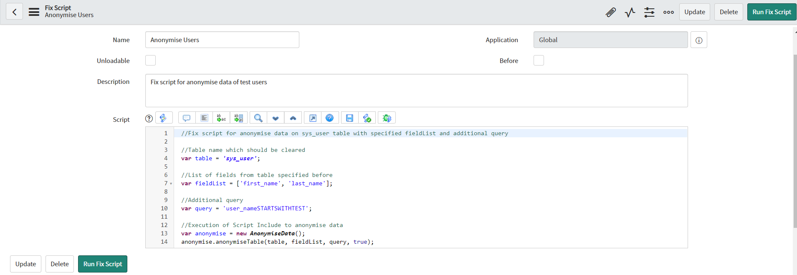
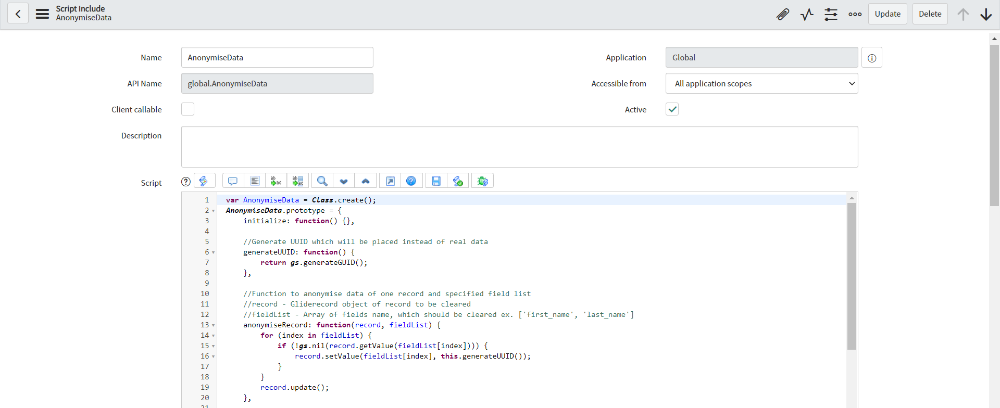
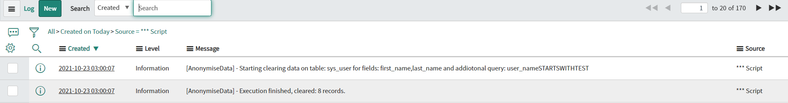
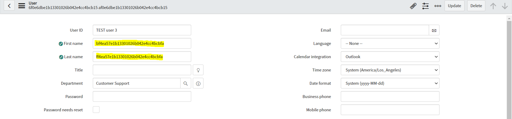

**Script Include** 

Script for anonymising data in specified table and chosen fields. You can pass an additional query to limit records which will be cleared. It can be used for example to remove GDPR data from development instances or anonymise old records. It can be used for example in fix script or scheduled job for long-term cleaning. 

**How to execute**

```javascript
//Table name which should be cleared
var table = 'sys_user';

//List of fields from table specified before
var fieldList = ['first_name', 'last_name'];

//Additional query
var query = 'user_nameSTARTSWITHTEST';

var anonymise = new AnonymiseData();
anonymise.anonymiseTable(table, fieldList, query, true);
```

You need to pass 4 parameters to function anonymiseTable

1. tablename - Name of table to be cleared ex. 'sys_user'
2. fieldList - Array of fields name, which should be cleared ex. ['first_name', 'last_name']
3. additionalQuery - Additional encoded query to limit list of records (if you would like to clear whole table just pass empty string)
4. logging - True/False value to determine if logging should be performed during execution

Example of Fix script execution:
 

**Example configuration of Script Include** 

 
 
**Execution logs**

 

**Effect of execution**

 

## Related Notes

- [[ServiceNowOfficialDocs/servicenow-dev-program/code-snippets/Specialized Areas/Fix scripts/Add Fields On All List Views/README|Add Fields On All List Views]]
- [[ServiceNowOfficialDocs/servicenow-dev-program/code-snippets/Specialized Areas/Fix scripts/Add Variable set to multiple catalog items/README|Add Variable set to multiple catalog items]]
- [[ServiceNowOfficialDocs/servicenow-dev-program/code-snippets/Specialized Areas/Fix scripts/Add bulk users to VTB/README|Add bulk users to VTB]]
- [[ServiceNowOfficialDocs/servicenow-dev-program/code-snippets/Specialized Areas/Fix scripts/Adjust Variable Order on Catalog Item/README|Adjust Variable Order on Catalog Item]]
- [[ServiceNowOfficialDocs/servicenow-dev-program/code-snippets/Specialized Areas/Fix scripts/Assign user list to a specific group/README|Assign user list to a specific group]]
- [[ServiceNowOfficialDocs/servicenow-dev-program/code-snippets/Specialized Areas/Fix scripts/Authenticate using ScriptedRESTAPI/README|Authenticate using ScriptedRESTAPI]]
