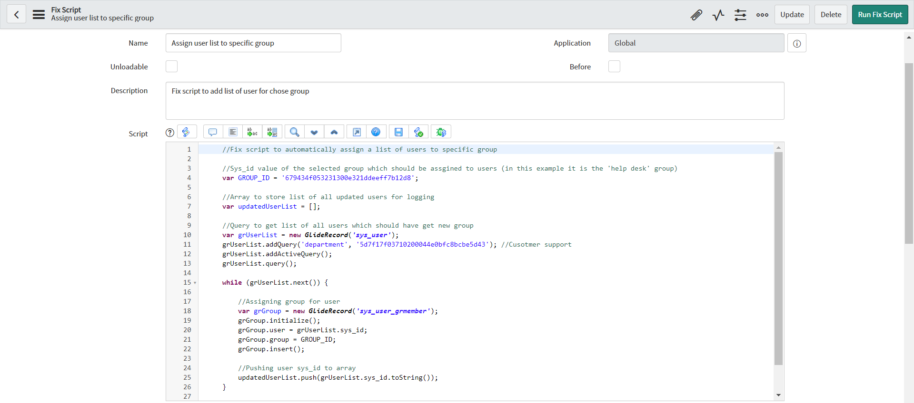
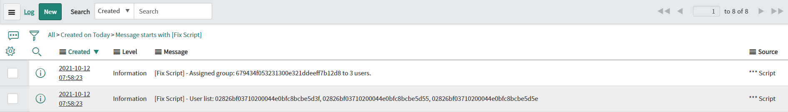

**Fix Script**

Script to *automatically assign a list of users to a specific group*; you can change the user query to prepare a correct list of users according to your needs. To assign a different group, change the value of the GROUP_ID variable to the sys_id of the group which you would like to assign. 

**Example configuration of Fix Script**

**Example execution logs**

## Related Notes

- [[ServiceNowOfficialDocs/servicenow-dev-program/code-snippets/Specialized Areas/Fix scripts/Add Fields On All List Views/README|Add Fields On All List Views]]
- [[ServiceNowOfficialDocs/servicenow-dev-program/code-snippets/Specialized Areas/Fix scripts/Add Variable set to multiple catalog items/README|Add Variable set to multiple catalog items]]
- [[ServiceNowOfficialDocs/servicenow-dev-program/code-snippets/Specialized Areas/Fix scripts/Add bulk users to VTB/README|Add bulk users to VTB]]
- [[ServiceNowOfficialDocs/servicenow-dev-program/code-snippets/Specialized Areas/Fix scripts/Adjust Variable Order on Catalog Item/README|Adjust Variable Order on Catalog Item]]
- [[ServiceNowOfficialDocs/servicenow-dev-program/code-snippets/Specialized Areas/Fix scripts/Anonymise Data/README|Anonymise Data]]
- [[ServiceNowOfficialDocs/servicenow-dev-program/code-snippets/Specialized Areas/Fix scripts/Authenticate using ScriptedRESTAPI/README|Authenticate using ScriptedRESTAPI]]
