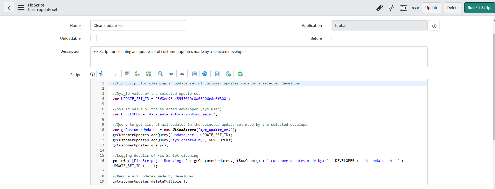
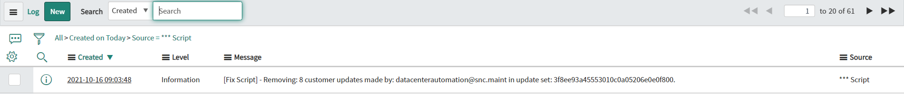
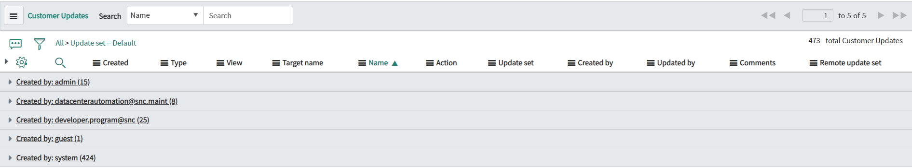
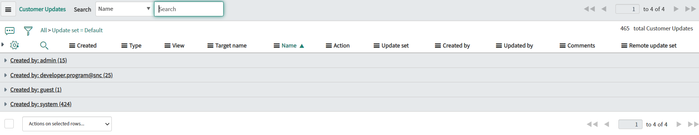

**Fix script**

Fix Script for cleaning update set from customer updates made by a selected developer. Script can be adjusted to match different query for cleaning which fits your needs.

Cleaning customer updates from update set is not removing updates made in system on direct records! It is just removing customer updates from update set to not move it to forward environments. 

*******
Enhancement - 8th october 2025
This scrip is an enhancement to existing script and will look for the default update set(same application) and move the customer update to default update set.
Deletion is not recommended way so moving to default is a better option.
*******
**Example configuration of Fix Script**

**Example execution logs**

**Example effect of execution**

Before execution:

After execution:

## Related Notes

- [[ServiceNowOfficialDocs/servicenow-dev-program/code-snippets/Specialized Areas/Fix scripts/Add Fields On All List Views/README|Add Fields On All List Views]]
- [[ServiceNowOfficialDocs/servicenow-dev-program/code-snippets/Specialized Areas/Fix scripts/Add Variable set to multiple catalog items/README|Add Variable set to multiple catalog items]]
- [[ServiceNowOfficialDocs/servicenow-dev-program/code-snippets/Specialized Areas/Fix scripts/Add bulk users to VTB/README|Add bulk users to VTB]]
- [[ServiceNowOfficialDocs/servicenow-dev-program/code-snippets/Specialized Areas/Fix scripts/Adjust Variable Order on Catalog Item/README|Adjust Variable Order on Catalog Item]]
- [[ServiceNowOfficialDocs/servicenow-dev-program/code-snippets/Specialized Areas/Fix scripts/Anonymise Data/README|Anonymise Data]]
- [[ServiceNowOfficialDocs/servicenow-dev-program/code-snippets/Specialized Areas/Fix scripts/Assign user list to a specific group/README|Assign user list to a specific group]]
