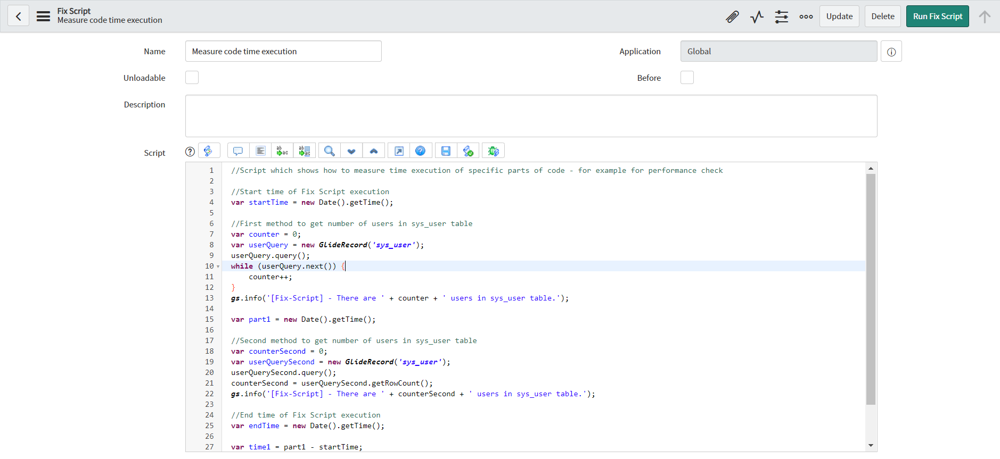
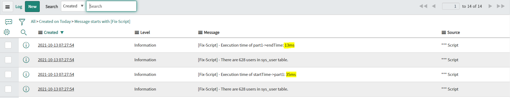

**Fix Script**

Script which is showing how to *measure time execution of specific part of code*. You can use it to check performance of code or track time execution of part of code in Fix Scripts. You can add any amount of measuring parts, based of your needs.

**Example configuration of Fix Script**

**Example execution logs**

## Related Notes

- [[ServiceNowOfficialDocs/servicenow-dev-program/code-snippets/Specialized Areas/Fix scripts/Add Fields On All List Views/README|Add Fields On All List Views]]
- [[ServiceNowOfficialDocs/servicenow-dev-program/code-snippets/Specialized Areas/Fix scripts/Add Variable set to multiple catalog items/README|Add Variable set to multiple catalog items]]
- [[ServiceNowOfficialDocs/servicenow-dev-program/code-snippets/Specialized Areas/Fix scripts/Add bulk users to VTB/README|Add bulk users to VTB]]
- [[ServiceNowOfficialDocs/servicenow-dev-program/code-snippets/Specialized Areas/Fix scripts/Adjust Variable Order on Catalog Item/README|Adjust Variable Order on Catalog Item]]
- [[ServiceNowOfficialDocs/servicenow-dev-program/code-snippets/Specialized Areas/Fix scripts/Anonymise Data/README|Anonymise Data]]
- [[ServiceNowOfficialDocs/servicenow-dev-program/code-snippets/Specialized Areas/Fix scripts/Assign user list to a specific group/README|Assign user list to a specific group]]
