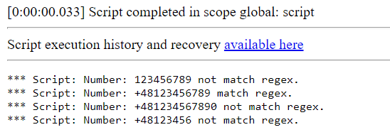

**Regular Expressions**

 Regular Expressions, which allows checking for Poland nine-digit Country code. Poland format starts with +48 and is followed by nine digits.

**Example effect of execution**

## Related Notes

- [[ServiceNowOfficialDocs/servicenow-dev-program/code-snippets/Specialized Areas/Regular Expressions/Adhaar validation/README|Adhaar validation]]
- [[ServiceNowOfficialDocs/servicenow-dev-program/code-snippets/Specialized Areas/Regular Expressions/Allow Characters + - ) ( for Phone numbers/README|Allow Characters + - ) ( for Phone numbers]]
- [[ServiceNowOfficialDocs/servicenow-dev-program/code-snippets/Specialized Areas/Regular Expressions/AllowAnyLanguage/README|AllowAnyLanguage]]
- [[ServiceNowOfficialDocs/servicenow-dev-program/code-snippets/Specialized Areas/Regular Expressions/Check for special characters/readme|Check for special characters]]
- [[ServiceNowOfficialDocs/servicenow-dev-program/code-snippets/Specialized Areas/Regular Expressions/Check if number has 10 digits/README|Check if number has 10 digits]]
- [[ServiceNowOfficialDocs/servicenow-dev-program/code-snippets/Specialized Areas/Regular Expressions/Consecutive duplicate words/README|Consecutive duplicate words]]
